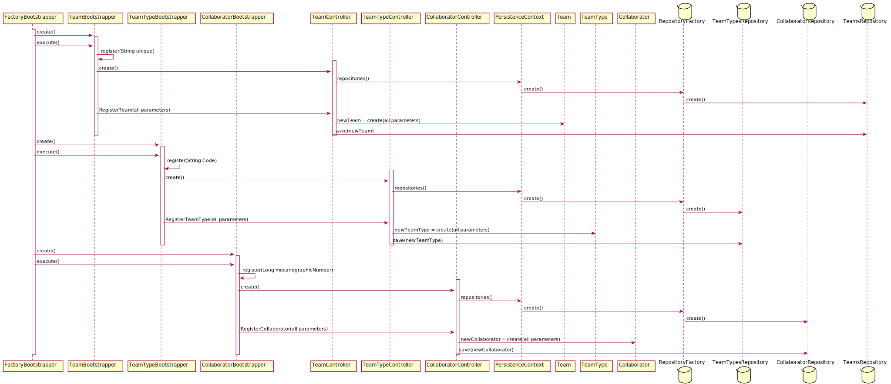

# UC11_Inicialização_Organização(Bootstrap)
=======================================

# 1. Requisitos

**UC11** Como Gestor de Projeto, eu pretendo que, para efeitos de demonstração, o sistema contemple a possibilidade de ser inicializado (bootstrap) com alguma informação relativa à estrutura orgânica da organização.

A interpretação feita deste requisito foi no sentido de criar uma forma de carregar para a base de dados alguma informação relativa a estrutura das organizações(Colaboradores, Equipas, Tipo de Equipas) assim que a aplicação for iniciada.

# 2. Análise

Enquanto é desenvolvido o programa é de interesse que não se tenha de inserir informação na base de dados de cada vez que o programa precisa ser testado. Sendo assim, faz-se bootstrap de organizações de forma a agilizar e a rentabilizar melhor o tempo da equipa no desenvolvimento do software.

# 3. Design

*Nesta secção a equipa deve descrever o design adotado para satisfazer a funcionalidade. Entre outros, a equipa deve apresentar diagrama(s) de realização da funcionalidade, diagrama(s) de classes, identificação de padrões aplicados e quais foram os principais testes especificados para validar a funcionalidade.*

*Para além das secções sugeridas, podem ser incluídas outras.*

## 3.1. Realização da Funcionalidade

## 3.2. Diagrama de Classes

*Nesta secção deve apresentar e descrever as principais classes envolvidas na realização da funcionalidade.*

## 3.3. Padrões Aplicados

*Nesta secção deve apresentar e explicar quais e como foram os padrões de design aplicados e as melhores práticas.*

## 3.4. Testes
*Nesta secção deve sistematizar como os testes foram concebidos para permitir uma correta aferição da satisfação dos requisitos.*

**Teste 1:** Verificar que não é possível criar uma instância da classe Exemplo com valores nulos.

	@Test(expected = IllegalArgumentException.class)
		public void ensureNullIsNotAllowed() {
		Exemplo instance = new Exemplo(null, null);
	}

# 4. Implementação

*Nesta secção a equipa deve providenciar, se necessário, algumas evidências de que a implementação está em conformidade com o design efetuado. Para além disso, deve mencionar/descrever a existência de outros ficheiros (e.g. de configuração) relevantes e destacar commits relevantes;*

*Recomenda-se que organize este conteúdo por subsecções.*

# 5. Integração/Demonstração

*Nesta secção a equipa deve descrever os esforços realizados no sentido de integrar a funcionalidade desenvolvida com as restantes funcionalidades do sistema.*

# 6. Observações

*Nesta secção sugere-se que a equipa apresente uma perspetiva critica sobre o trabalho desenvolvido apontando, por exemplo, outras alternativas e ou trabalhos futuros relacionados.*
