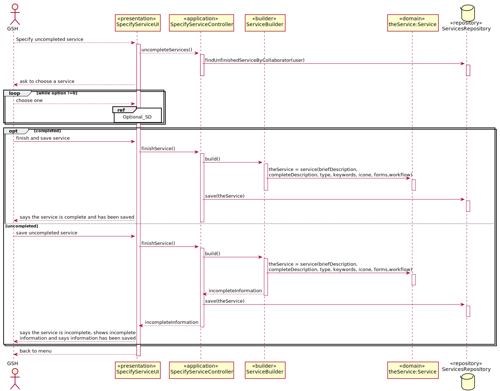
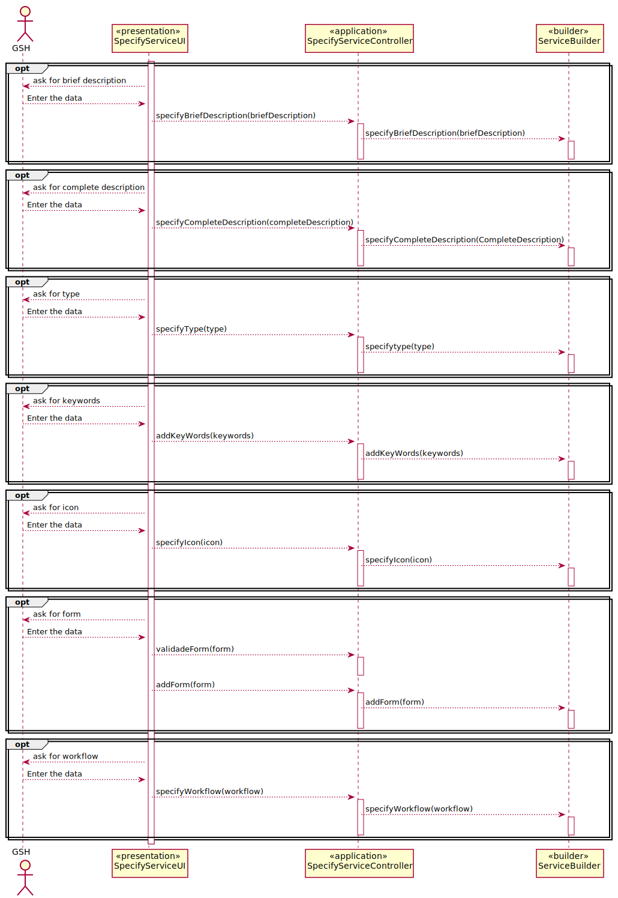

# US2003_Completar_Especificação_de_Serviço
=======================================

# 1. Requisitos

**UC 4.1.7** Como GSH, eu pretendo continuar/completar a especificação em curso de um serviço.

A interpretação feita deste requisito foi no sentido de continuar/completar um serviço que foi criado previamente no sistema.

# 2. Análise
**Pré-Análise** - É necessário existir no sistema um colaborador para completar a especificação do serviço e deverá também existir um serviço incompleto por parte de esse colaborador.

A inserção de novos dados para continuar/completar os requisitos necessários de um script deve ser feito por um Gestor de Serviços de Help desk, que deve usar o menu para associar os restantes dados que faltam num serviço(incluido o fluxo de atividades).

O serviço só deve ficar disponível para solicitação quando a sua especificação ficar completa e válida. Deve ser utilizado a linguagem/gramática desenvolvida para validar os formulários.

**Pós-Análise** - O serviço será criado e com todos os dados e passa a estar disponível para pedidos.

# 3. Design

Para responder a este problema foi usado o padrão Controller para criar o controlador SpecifyServiceController. Este controlador é responsável pelo tratamento do processo de criação de un novo serviço no sistema, esteja ele completo ou incompleto. Este controlador por sua vez faz uso do padrão Builder e mais precisamente da classe ServiceBuilder para ir adicionando componentes ao serviço e depois usa a classe Service para criar uma instância de serviço. Para persistir esta informação no sistema é usado o padrão Repository. O controlador usa ServiceRepository para guardar a informação em base de dados.

Tendo em conta que temos de escolher um serviço para editar é necessário mostrar os serviços incompletos do colaborador autenticado no sistema. Para tal é utilizado o método findUnfinishedServiceByCollaborator definido na base de dados.

## 3.1. Realização da Funcionalidade

*Nesta secção deve apresentar e descrever o fluxo/sequência que permite realizar a funcionalidade.*

**References:**

## 3.2. Diagrama de Classes

*Nesta secção deve apresentar e descrever as principais classes envolvidas na realização da funcionalidade.*

## 3.3. Padrões Aplicados

Controller, Repository e Builder

## 3.4. Testes
*Nesta secção deve sistematizar como os testes foram concebidos para permitir uma correta aferição da satisfação dos requisitos.*

**Teste 1 a 11:** Verificar que não é possível criar uma instância da classe Service se este já não for um draft com valores nulos em uniqueCode,title,briefDescription,completeDesciption,type,keywords,icone,form,isDraft,collaborator, workflows.

	@Test(expected = IllegalArgumentException.class)
		public void ensureRequestCantHaveNull<xField>() {
		Service instance = new Service(every field not null except xField and isDraft = 0);
	}

**Teste 12** Verificar que não é possível criar uma briefDescription se este for maior que 50

    @Test(expected = IllegalArgumentException.class)
    public void ensureBriefDescriptionNotOversized() {
      BriefDescription bd = new BriefDescription("11111111111111111111111111111111111111111111111111111111111111");
    }

**Teste 12** Verificar que não é possível criar uma completeDesciption se este for maior que 100

    @Test(expected = IllegalArgumentException.class)
    public void ensureCompleteDescriptionNotOversized() {
      CompleteDescription bd = new CompleteDescription("11111111111111111111111111111111111111111111111111111111111111" +
                "1111111111111111111111111111111111111111111111111111111111111111111111111111111111111111111111111111111111111111111111111111");
    }

**Teste 12** Verificar que não é possível criar um title se este for maior que 20

    @Test(expected = IllegalArgumentException.class)
    public void ensureCompleteDescriptionNotOversized() {
      Title title = new Title("111111111111111111111111111111111");
    }

# 4. Implementação

*Nesta secção a equipa deve providenciar, se necessário, algumas evidências de que a implementação está em conformidade com o design efetuado. Para além disso, deve mencionar/descrever a existência de outros ficheiros (e.g. de configuração) relevantes e destacar commits relevantes;*

*Recomenda-se que organize este conteúdo por subsecções.*

# 5. Integração/Demonstração

*Nesta secção a equipa deve descrever os esforços realizados no sentido de integrar a funcionalidade desenvolvida com as restantes funcionalidades do sistema.*

# 6. Observações

*Nesta secção sugere-se que a equipa apresente uma perspetiva critica sobre o trabalho desenvolvido apontando, por exemplo, outras alternativas e ou trabalhos futuros relacionados.*
