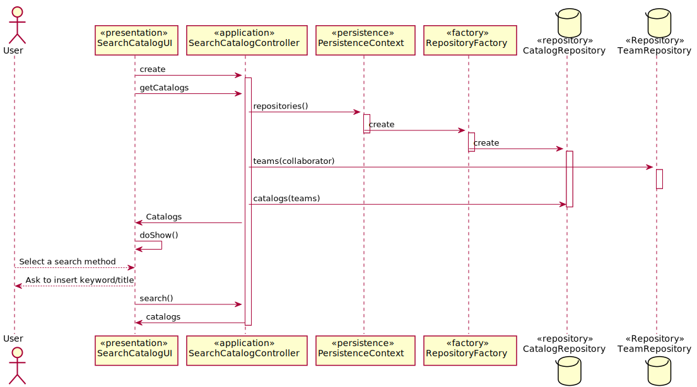

# US3001_Pesquisar Catálogo Disponível
=======================================

# 1. Requisitos

Como utilizador, eu pretendo consultar os catálogos de serviços e os seus respetivos serviços que me estão disponibilizados.

# 2. Análise

Um utilizador usa um menu para pesquisar/consultar os catálogos de serviços. Também tem de ser capaz de consultar os serviços de cada catálogo. A pesquisa deve ser orientada através das keywords dos serviços, pelos títulos e os resultados devem ficar agrupados por catálogo. Também deve aparecer informação caso a especificação de um serviço não esteja completa.

# 3. Design

Para responder a esta funcionalidade o controller vai buscar quais os catálogos que se encontram disponibilizados para cada colaborador, dependendo da sua função. Irá também conseguir pesquisar através de palavras chave ou titulos.

## 3.1. Realização da Funcionalidade

## 3.2. Diagrama de Classes

*Nesta secção deve apresentar e descrever as principais classes envolvidas na realização da funcionalidade.*

## 3.3. Padrões Aplicados

Controller e Repository

## 3.4. Testes
*Nesta secção deve sistematizar como os testes foram concebidos para permitir uma correta aferição da satisfação dos requisitos.*

**Teste 1:** Verificar que não é possível criar uma instância da classe Exemplo com valores nulos.

	@Test(expected = IllegalArgumentException.class)
		public void ensureNullIsNotAllowed() {
		Exemplo instance = new Exemplo(null, null);
	}

# 4. Implementação

*Nesta secção a equipa deve providenciar, se necessário, algumas evidências de que a implementação está em conformidade com o design efetuado. Para além disso, deve mencionar/descrever a existência de outros ficheiros (e.g. de configuração) relevantes e destacar commits relevantes;*

*Recomenda-se que organize este conteúdo por subsecções.*

# 5. Integração/Demonstração

*Nesta secção a equipa deve descrever os esforços realizados no sentido de integrar a funcionalidade desenvolvida com as restantes funcionalidades do sistema.*

# 6. Observações

*Nesta secção sugere-se que a equipa apresente uma perspetiva critica sobre o trabalho desenvolvido apontando, por exemplo, outras alternativas e ou trabalhos futuros relacionados.*
