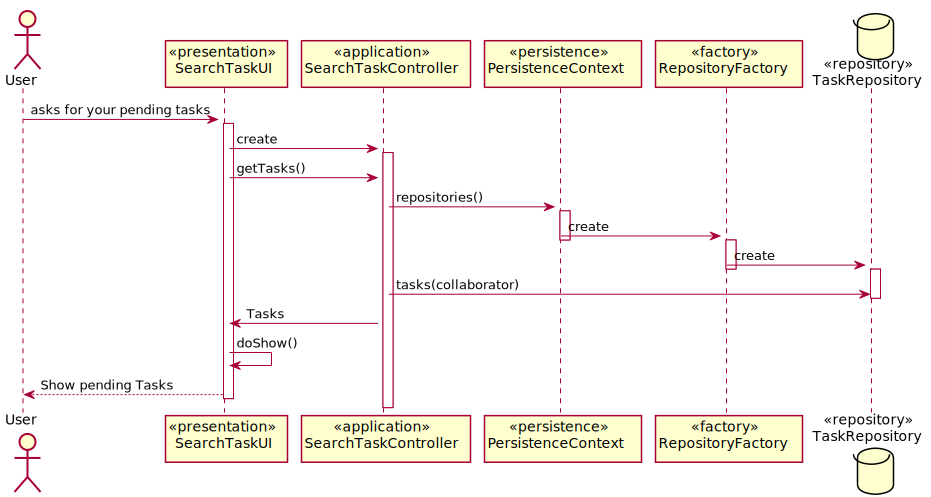

# US3021Consultar_Tarefas
=======================================

# 1. Requisitos

Como utilizador, eu pretendo consultar as tarefas pendentes que me estão assignadas.

A interpretação feita deste requisito foi no sentido de especificar no sistema todas as tarefas a que aquele colaborador esta associado

# 2. Análise

**Pré-Análise** - É necessário a existência de tarefas no sistema assignadas ao colaborador que tem sessao iniciada no sistema.

A consulta das tarefas assignadas a um colaborador pode ser feito manualmente pelo próprio colaborador (utilizador), que usa o seu menu para dar login no sistema e seguidamente proceder a consulta das suas tarefas. O Colaborador (utilizador) ao consultar as suas tarefas tinha uma imediata perceção da prioridade, criticidade, e data limite de conclusão de cada tarefa.

**Pós-Análise** - Será mostrado na consola ao utilizador as suas tarefas pendentes.

# 3. Design

Para responder a este problema foi usado o padrão Controller para criar o controlador SearchTasksController. Este controlador é responsável pelo tratamento do processo de pesquisa de todas as tarefas de um colaborador (Utilizador) no sistema. Este controlador por sua vez faz uso da classe task para pesquisar uma instância de task. Para persistir esta informação no sistema é usado o padrão Repository. O controlador usa TaskRepository para guardar a informação em base de dados.

## 3.1. Realização da Funcionalidade

## 3.2. Diagrama de Classes

*Nesta secção deve apresentar e descrever as principais classes envolvidas na realização da funcionalidade.*

## 3.3. Padrões Aplicados

Controler e Repository

## 3.4. Testes

Não existe qualquer tipo de teste/verificação possível neste UC.

# 4. Implementação

*Nesta secção a equipa deve providenciar, se necessário, algumas evidências de que a implementação está em conformidade com o design efetuado. Para além disso, deve mencionar/descrever a existência de outros ficheiros (e.g. de configuração) relevantes e destacar commits relevantes;*

*Recomenda-se que organize este conteúdo por subsecções.*

# 5. Integração/Demonstração

*Nesta secção a equipa deve descrever os esforços realizados no sentido de integrar a funcionalidade desenvolvida com as restantes funcionalidades do sistema.*

# 6. Observações

*Nesta secção sugere-se que a equipa apresente uma perspetiva critica sobre o trabalho desenvolvido apontando, por exemplo, outras alternativas e ou trabalhos futuros relacionados.*
