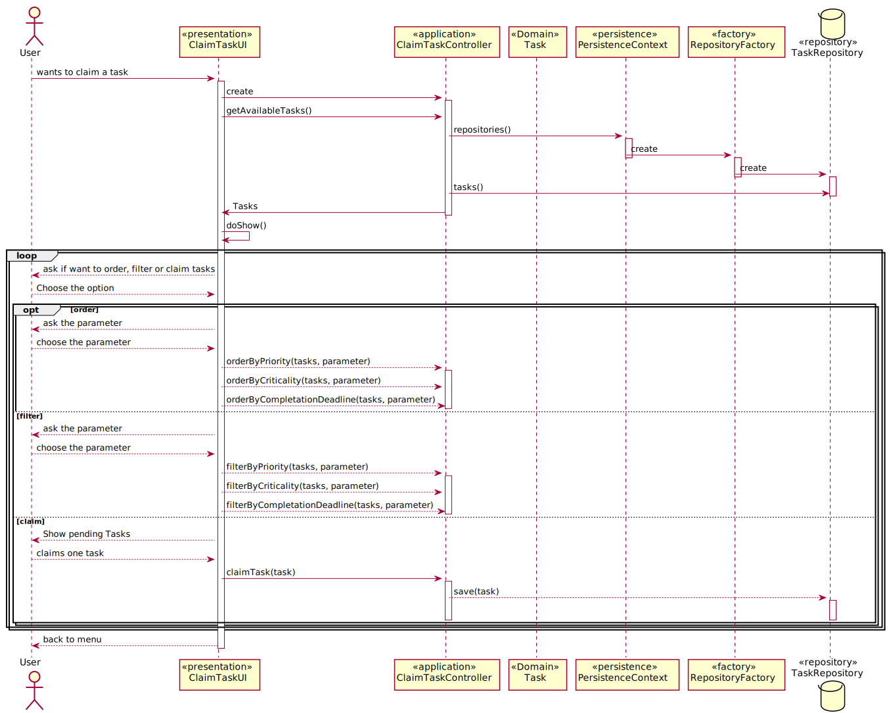

# US3022_Consultar tarefas pendentes

=======================================

# 1. Requisitos

**UC 4.2.6b-7** Como utilizador, eu pretendo consultar as tarefas pendentes que eu posso reivindicar para mim e, caso o deseje, concretize essa reivindicação.

A interpretação feita deste requisito foi no sentido de o utilizador ter acesso a todas as tarefas assignadas somente ao próprio, de modo a poder reivindica-la para si. Esta listagem poderá estar sujeita a uma filtragem e/ou reordenação das várias tarefas disponíveis.

# 2. Análise

**Pre-Condições:** Deverão já existir guardadas no sistema tanto tarefas sem colaboradores associados como colaboradores para as reivindicar.

O utilizador usa o seu menu para escolher listar as tarefas pendentes. Num submenu irá ser questionado segundo o critério de ordenação das tarefas existentes segundo os campos disponíveis. Após essa seleção, o utilizador poderá requerer para si uma determinada tarefa pendente e ainda não assignada a nenhum outro colaborador.

# 3. Design

Para responder a este problema foi usado o padrão Controller para criar o controlador ClaimTaskController. Este controlador é responsável pelo tratamento do processo de associação de uma tarefa ao utilizador.

## 3.1. Realização da Funcionalidade

## 3.2. Diagrama de Classes

*Nesta secção deve apresentar e descrever as principais classes envolvidas na realização da funcionalidade.*

## 3.3. Padrões Aplicados

Controller e Repository

## 3.4. Testes

Não existe qualquer tipo de teste/verificação possível neste UC.

# 4. Implementação

*Nesta secção a equipa deve providenciar, se necessário, algumas evidências de que a implementação está em conformidade com o design efetuado. Para além disso, deve mencionar/descrever a existência de outros ficheiros (e.g. de configuração) relevantes e destacar commits relevantes;*

*Recomenda-se que organize este conteúdo por subsecções.*

# 5. Integração/Demonstração

*Nesta secção a equipa deve descrever os esforços realizados no sentido de integrar a funcionalidade desenvolvida com as restantes funcionalidades do sistema.*

# 6. Observações

*Nesta secção sugere-se que a equipa apresente uma perspetiva critica sobre o trabalho desenvolvido apontando, por exemplo, outras alternativas e ou trabalhos futuros relacionados.*
