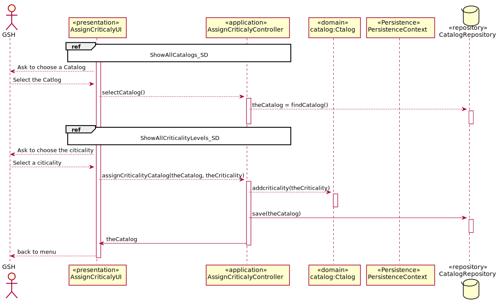

# US2012Atribuir_Criticidade
=======================================

# 1. Requisitos

Como GSH, eu pretendo atribuir o nível de criticidade aplicado a um catálogo de serviços.

A interpretação feita deste requisito foi no sentido de especificar no sistema o nível de criticidade de um catalogo de serviços.

# 2. Análise

**Pré-Análise** - É necessário a existência de niveis de criticidade no sistema bem como a existencia de catalogos para que possa ser feita a associação entre eles.

A consulta das tarefas assignadas a um colaborador pode ser feito manualmente pelo próprio colaborador (utilizador), que usa o seu menu para dar login no sistema e seguidamente proceder a consulta das suas tarefas. O Colaborador (utilizador) ao consultar as suas tarefas tinha uma imediata perceção da prioridade, criticidade, e data limite de conclusão de cada tarefa.

**Pós-Análise** - Será realizada a associação de um nivel de criticidade a um catalogo.

A atribuição do nível de criticidade a catálogos de serviços é feita pelo Gestor de Serviços de Help desk (GSH) que usa o seu menu para atribuir esses mesmos níveis aos respetivos catálogos bem como pode fazer uma atribuição customizada, uma vez que pode alterar os parâmetros Sla's para os parâmetros que bem entender de forma a não ficar "preso" aos parâmetros definidos inicialmente.

# 3. Design

Para responder a este problema foi usado o padrão Controller para criar o controlador AssignCriticalityController. Este controlador é responsável pelo tratamento do processo de associação de um nível de criticidade relativamente a um catalogo. Este controlador por sua vez faz uso da classe Catalog para alterar o nível de criticidade nela presentes(que inicialmente estão a null). Para persistir esta informação no sistema é usado o padrão Repository. O controlador usa CatalogRepository para guardar a nova informação em base de dados.

O sistema poderá possuir vários catálogos, pelo que o controller irá buscar todos esses valores e disponibiliza-los ao utilizador de modo a facilitar a escolha do catalogo a alterar.
No processo de adição, o utilizador irá escolher de uma lista o nível de criticidade que deseja atribuir ao catalogo , sendo o controller responsável por obter o objeto da classe Criticality e adiciona-lo ao catalogo, seguindo-se o armazenamento desta nova informação.

## 3.1. Realização da Funcionalidade

### References

* ShowAllCatalogs_SD 

* ShowAllCriticalityLevels_SD 

## 3.2. Diagrama de Classes

*Nesta secção deve apresentar e descrever as principais classes envolvidas na realização da funcionalidade.*

## 3.3. Padrões Aplicados

Controller e Repository

## 3.4. Testes

*Nesta secção deve sistematizar como os testes foram concebidos para permitir uma correta aferição da satisfação dos requisitos.*

# 4. Implementação

*Nesta secção a equipa deve providenciar, se necessário, algumas evidências de que a implementação está em conformidade com o design efetuado. Para além disso, deve mencionar/descrever a existência de outros ficheiros (e.g. de configuração) relevantes e destacar commits relevantes;*

*Recomenda-se que organize este conteúdo por subsecções.*

# 5. Integração/Demonstração

*Nesta secção a equipa deve descrever os esforços realizados no sentido de integrar a funcionalidade desenvolvida com as restantes funcionalidades do sistema.*

# 6. Observações

*Nesta secção sugere-se que a equipa apresente uma perspetiva critica sobre o trabalho desenvolvido apontando, por exemplo, outras alternativas e ou trabalhos futuros relacionados.*
