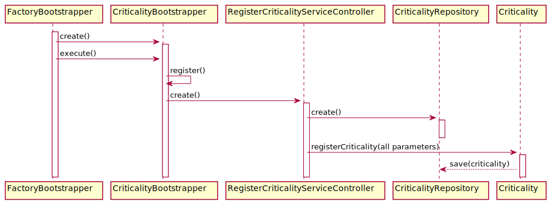

# US2105_Bootstrap de Níveis de Criticidade
=======================================

# 1. Requisitos

**UC 4.1.8-9** Como Gestor de Projeto, eu pretendo que, para efeitos de demonstração, o sistema contemple a possibilidade de ser inicializado (bootstrap) com (i) um conjunto de níveis de criticidade e respetivos objetivos aplicados pela organização e (ii) a atribuição de alguns desses níveis a catálogos de serviços.

A interpretação feita deste requisito foi no sentido de criar uma forma de carregar para a base de dados níveis de criticidade e os respetivos objetivos, assim como a sua associação a catálogos.

# 2. Análise

Enquanto é desenvolvido o programa é de interesse que não se tenha de inserir informação na base de dados de cada vez que o programa precisa ser testado. Sendo assim, faz-se bootstrap de serviços de forma a agilizar e a rentabilizar melhor o tempo da equipa no desenvolvimento do software.

# 3. Design

## 3.1. Realização da Funcionalidade

## 3.2. Diagrama de Classes

*Nesta secção deve apresentar e descrever as principais classes envolvidas na realização da funcionalidade.*

## 3.3. Padrões Aplicados

Controller e Repository

## 3.4. Testes
*Nesta secção deve sistematizar como os testes foram concebidos para permitir uma correta aferição da satisfação dos requisitos.*

# 4. Implementação

*Nesta secção a equipa deve providenciar, se necessário, algumas evidências de que a implementação está em conformidade com o design efetuado. Para além disso, deve mencionar/descrever a existência de outros ficheiros (e.g. de configuração) relevantes e destacar commits relevantes;*

*Recomenda-se que organize este conteúdo por subsecções.*

# 5. Integração/Demonstração

*Nesta secção a equipa deve descrever os esforços realizados no sentido de integrar a funcionalidade desenvolvida com as restantes funcionalidades do sistema.*

# 6. Observações

*Nesta secção sugere-se que a equipa apresente uma perspetiva critica sobre o trabalho desenvolvido apontando, por exemplo, outras alternativas e ou trabalhos futuros relacionados.*
