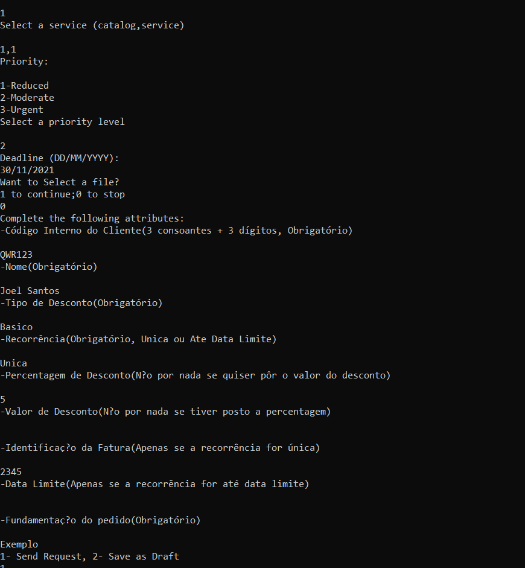
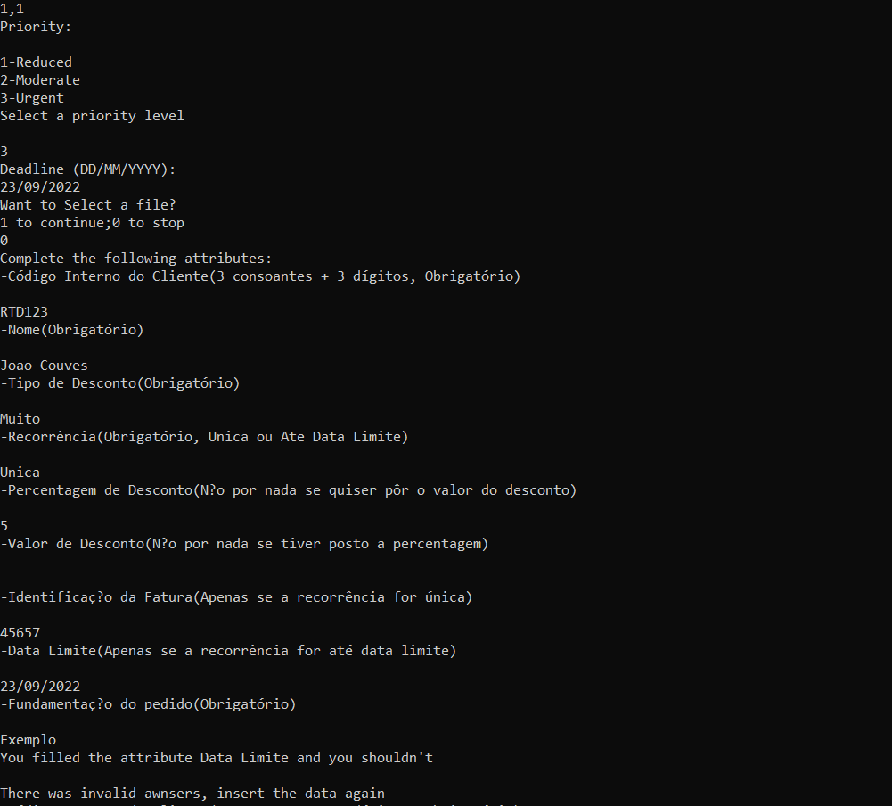
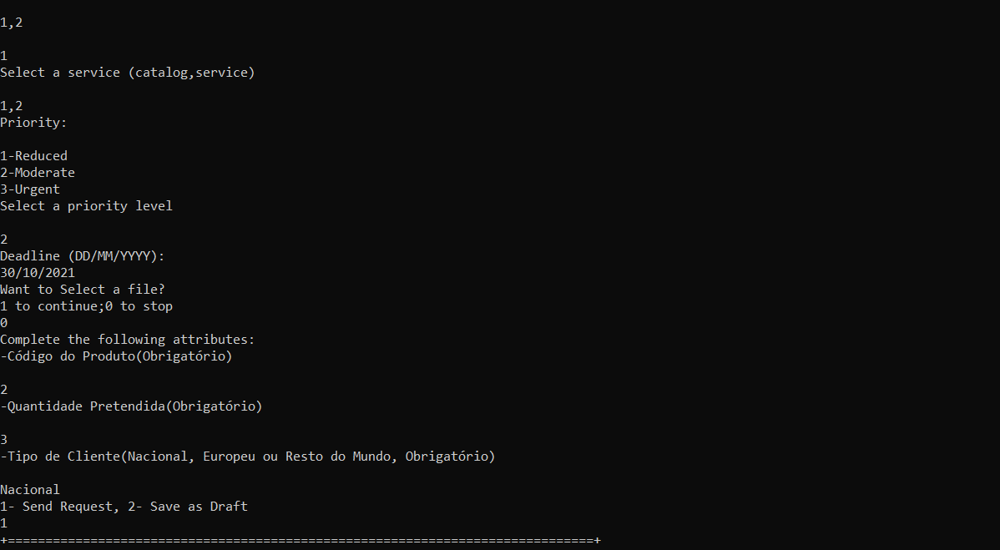
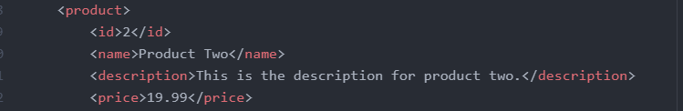

# US1007 Capacidade de execução de scripts
=======================================

# 1. Requisitos

Como Gestor de Projeto, eu pretendo que o sistema seja capaz de executar/interpretar os scripts especificados na linguagem/gramática anteriormente desenvolvida.

# 2. Análise

**Pré-Requisitos** Deve(m) estar desenvolvida(s) a(s) linguagem(s) de suporte ao sistema.

Para além da validação semântica e sintática das expressões suportadas pela linguagem, é requerida também a sua execução e interpretação. Deve ser possível o envio de emails a um colaborador que pediu um serviço e pesquisar informação pretendida em ficheiros XML.

**Pós-Requisitos** Deve ser possível executar os scripts com as funcionalidades pretendidas

# 3. Design

Foram criadas as classes FormValidator e TaskValidator com métodos que gerem a comunicação entre os visitors e a informação passada por parâmetro. Os métodos são o validateScript(chamado aquando da introdução de um formulário ou aquando da especificaçaõ de um serviço) que valida a lexica de um script, o verifyData(chamado aquando da introdução das respostas por parte de um solicitador de serviço) que verifica as respostas a um formulário tendo em conta um script, o executeScript(chamado no executor de tarefas automáticas) que executa as operações definidas num script.

## 3.1. Realização da Funcionalidade

*Nesta secção deve apresentar e descrever o fluxo/sequência que permite realizar a funcionalidade.*

## 3.2. Diagrama de Classes

*Nesta secção deve apresentar e descrever as principais classes envolvidas na realização da funcionalidade.*

## 3.3. Padrões Aplicados

*Nesta secção deve apresentar e explicar quais e como foram os padrões de design aplicados e as melhores práticas.*

## 3.4. Testes
* Teste funcional da Linguagem de validação de um formulário
  * Esta linguagem valida as respostas introduzidas aos atributos de um formulário. Quando estas são bem introduzidas o programa decorre normalmente sendo efetuado um pedido(como se pode ver na imagem abaixo)

	
 * Quando as respostas não são introduzidas de acordo com o definido no script(por exemplo necessidade de introdução de um certo atributo) o programa alerta para tal e pede uma nova introdução das respostas(como se pode ver na imagem abaixo)
 

* Teste funcional da Linguagem de execução de uma tarefa automática
	* Esta linguagem efetua operações de pesquisa em ficheiros XML, cálculos, e envio de emails. Neste teste funcional, o utilizador seleciona o produto 2, e requer uma quantidade de 3(como se pode ver na imagem abaixo)
	 

	 O produto 2 tem um preço de 19,99€ que o programa irá pesquisar ao ficheiro XML com as informações dos produtos(como se vê na imagem abaixo)

	  

		De seguida, o programa terá de enviar um email ao colaborador que pediu este serviço. Nesse email devem constar o valor da sua compra e o desconto aplicado(1%). Estes dois valores também são calculados pelo programa e, os valores esperados devem ser 59,97€ de preço original(19,99 *3) e de 59,37€ de valor com desconto(59,97 * 0.99)(Podemos confirmar tal coisa na imagem abaixo)

		

		##### Conclusão
		Tal como podemos observar nas imagens representativas da execução do programa acima o caso de sucesso verifica-se pelo que o teste é verdadeiro

# 4. Implementação

*Nesta secção a equipa deve providenciar, se necessário, algumas evidências de que a implementação está em conformidade com o design efetuado. Para além disso, deve mencionar/descrever a existência de outros ficheiros (e.g. de configuração) relevantes e destacar commits relevantes;*

*Recomenda-se que organize este conteúdo por subsecções.*

# 5. Integração/Demonstração

*Nesta secção a equipa deve descrever os esforços realizados no sentido de integrar a funcionalidade desenvolvida com as restantes funcionalidades do sistema.*

# 6. Observações

*Nesta secção sugere-se que a equipa apresente uma perspetiva critica sobre o trabalho desenvolvido apontando, por exemplo, outras alternativas e ou trabalhos futuros relacionados.*
