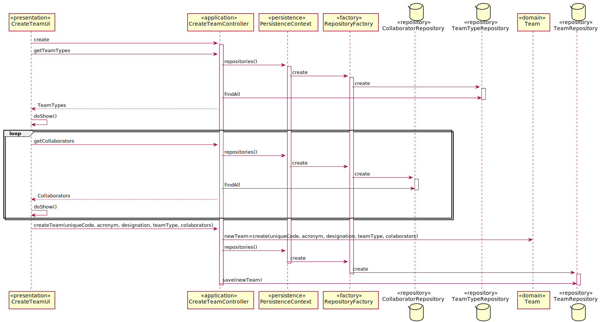

# US2052_Criação de Equipa
=======================================

# 1. Requisitos

Como Responsável de Recursos Humanos(RRH), eu pretendo criar uma nova equipa

# 2. Análise

O Responsável de Recursos Humanos(RRH) usa o menu para definir a existência de uma nova equipa. Cada equipa tem de possuir um código único, um acrónimo também este único e uma designação. O RRH ao criar uma equipa pode definir um ou mais colaboradores responsáveis por esta. Aquando da criação da equipa deve também ser selecionado o seu tipo.

# 3. Design

Para responder a este problema foi usado o padrão Controller para criar o controlador CreateTeamController. Este controlador é responsável pelo tratamento do processo de criação de uma nova equipa no sistema. Este controlador por sua vez faz uso da classe Team para criar uma instância de equipa. Para persistir esta informação no sistema é usado o padrão Repository. O controlador usa TeamRepository para guardar a informação em base de dados.

Tendo em conta que uma equipa tem um ou mais colaboradores responsáveis por esta e tem também um tipo de equipa, o controller vai buscar quais os colaboradores e quais os tipos de equipa disponíveis para que o RRH os escolha. Quando este escolher e introduzir os dados necessários então será criada uma nova equipa.

## 3.1. Realização da Funcionalidade

## 3.2. Diagrama de Classes

*Nesta secção deve apresentar e descrever as principais classes envolvidas na realização da funcionalidade.*

## 3.3. Padrões Aplicados

Controller e Repository

## 3.4. Testes
*Nesta secção deve sistematizar como os testes foram concebidos para permitir uma correta aferição da satisfação dos requisitos.*

**Teste 1 a 3:** Verificar que não é possível criar uma instância da classe Exemplo com valores nulos em uniqueCode, acronym, designation.

	@Test(expected = IllegalArgumentException.class)
		public void ensureTeamCantHaveNull<xField>() {
		Exemplo instance = new Exemplo(every field not null except xField);
	}

**Teste 4:** Verificar que não é possível criar uma instância da classe Equipa sem o uniqueCode obedecer às restrições aplicadas pelo cliente.

		public boolean ensureUniqueCodeMeetsCorrectSize(String uniqueCode){
			if(uniqueCode <= 15){
				return true;
			}else{
				return false;
			}
	}

# 4. Implementação

*Nesta secção a equipa deve providenciar, se necessário, algumas evidências de que a implementação está em conformidade com o design efetuado. Para além disso, deve mencionar/descrever a existência de outros ficheiros (e.g. de configuração) relevantes e destacar commits relevantes;*

*Recomenda-se que organize este conteúdo por subsecções.*

# 5. Integração/Demonstração

*Nesta secção a equipa deve descrever os esforços realizados no sentido de integrar a funcionalidade desenvolvida com as restantes funcionalidades do sistema.*

# 6. Observações

*Nesta secção sugere-se que a equipa apresente uma perspetiva critica sobre o trabalho desenvolvido apontando, por exemplo, outras alternativas e ou trabalhos futuros relacionados.*
