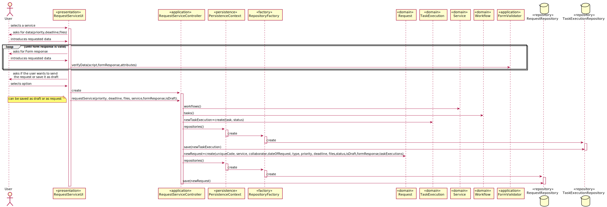
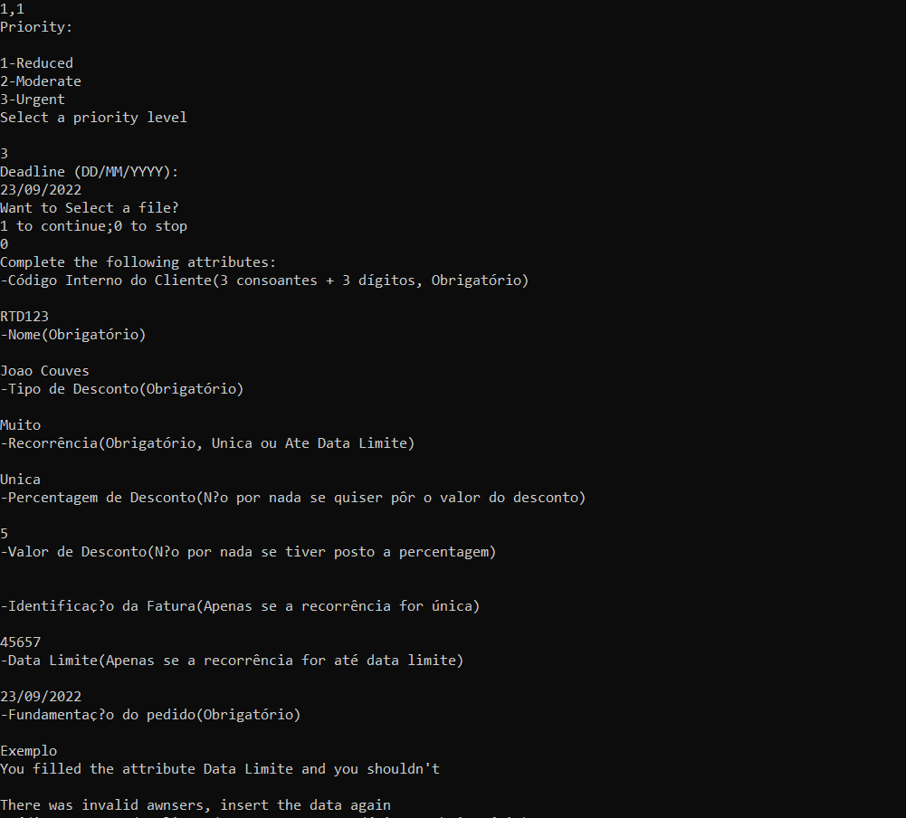

# US3003 Solicitar Catálogo
=======================================

# 1. Requisitos

Como utilizador, eu pretendo solicitar um serviço do catálogo de serviços que me é disponibilizado.

A interpretação feita deste requisito foi no sentido de um utilizador poder solicitar pedidos dentro dos que lhe estão disponíveis.

# 2. Análise

**Pré-Análise:** No sistema já deverão existir guardados catálogos, e seus serviços completos. Também já devem existir colaboradores registados.

**Pós-Análise:** Deve ser efetuado o pedido.

Um utilizador usa o menu para pesquisar/consultar catálogos de serviços e os respetivos serviços. Podem ser efetuadas pesquisas orientadas por keywords ou titulos. O utilizador pode depois solicitar um serviço dentro dos disponíveis. Aquando da solicitação o utilizador insere a prioridade do pedido, a data limite de resolução pretendida e pode anexar um conjunto de ficheiros ao pedido. Pode também escolher se quer enviar já o pedido ou se quer guardar como draft para ser enviado depois.

Nesta US o objetivo é refinar a US 3002. Devem ser executadas e interpretadas as expressões da linguagem desenvolvida(na validação de um formulário).

# 3. Design

Para responder a este problema foi usado o padrão Controller para criar o controlador RequestServiceController. Este controlador é responsável pelo tratamento do processo de criação de um novo pedido no sistema. Este controlador por sua vez faz uso da classe Request para criar uma instância de Pedido. Para persistir a informação no sistema foi usado o padrão Repository. O controlador usa RequestRepository para guardar a informação em base de dados e em memoria.
Nesta UC também são criados TaskExecution associadas aos Pedidos. São utilizados os mesmos padrões e o TaskExecutionRepository para criar instâcias de TaskExecution e persistir em base de dados e em memoria.

É chamado um método que irá validar as respostas ao formulário introduzidas pelo utilizador através da interpretação da linguagem criada. Caso as respostas não estejam de acordo com a linguagem e pedida a sua introdução novamente.

## 3.1. Realização da Funcionalidade

## 3.2. Diagrama de Classes

*Nesta secção deve apresentar e descrever as principais classes envolvidas na realização da funcionalidade.*

## 3.3. Padrões Aplicados

Controller, Create e Repository

## 3.4. Testes
*Nesta secção deve sistematizar como os testes foram concebidos para permitir uma correta aferição da satisfação dos requisitos.*

**Teste 1 a 10:** Verificar que não é possível criar uma instância da classe Request com valores nulos em uniqueCode,service,collaborator,dateOfRequest,type,priority,deadline,status,isDraft,formResponse.

	@Test(expected = IllegalArgumentException.class)
		public void ensureRequestCantHaveNull<xField>() {
		Request instance = new Request(every field not null except xField);
	}

**Teste 11 e 12:** Verificar que não é possível criar uma instância da classe TaskExecution com valores nulos em task,status;

	@Test(expected = IllegalArgumentException.class)
		public void ensureTaskExecutionCantHaveNull<xField>() {
		TaskExecution instance = new TaskExecution(every field not null except xField);
	}

###### Teste funcional da Linguagem de validação de um formulário

* Esta linguagem valida as respostas introduzidas aos atributos de um formulário. Quando estas são bem introduzidas o programa decorre normalmente sendo efetuado um pedido(como se pode ver na imagem abaixo)

 
* Quando as respostas não são introduzidas de acordo com o definido no script(por exemplo necessidade de introdução de um certo atributo) o programa alerta para tal e pede uma nova introdução das respostas(como se pode ver na imagem abaixo)

# 4. Implementação

*Nesta secção a equipa deve providenciar, se necessário, algumas evidências de que a implementação está em conformidade com o design efetuado. Para além disso, deve mencionar/descrever a existência de outros ficheiros (e.g. de configuração) relevantes e destacar commits relevantes;*

*Recomenda-se que organize este conteúdo por subsecções.*

# 5. Integração/Demonstração

*Nesta secção a equipa deve descrever os esforços realizados no sentido de integrar a funcionalidade desenvolvida com as restantes funcionalidades do sistema.*

# 6. Observações

*Nesta secção sugere-se que a equipa apresente uma perspetiva critica sobre o trabalho desenvolvido apontando, por exemplo, outras alternativas e ou trabalhos futuros relacionados.*
