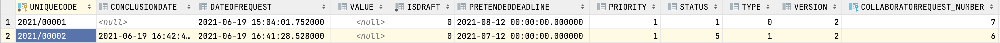

# US4003_Conclusão do motor do fluxo de atividades

=======================================

# 1. Requisitos

**UC 4.3.1** Como Gestor de Projeto, eu pretendo que a equipa conclua o desenvolvimento do motor de fluxos de atividades tornando-o bastante robusto.
	* Refinar US 4001 e US 4002.

A interpretação feita deste requisito foi no sentido de melhorar o Motor de Fluxos de Atividades.

# 2. Análise

**Pré-Análise:** Devem existir já criados pedidos e tarefas.

Caso o Motor de Fluxo de Atividade encontre uma atividade automática, deve solicitar e monitorizar a execução desta pelo Executor de Tarefas Automáticas.
O Motor de Fluxo de Atividades vai percorrendo os pedidos, e gera o estado destes(dependendo do estado das suas atividades, pode estar em submetido, em aprovação, aprovado, rejeitado, em resolução, concluído). Se um pedido se encontrar no estado de "submetido", o mecanismo irá gerir os estados das suas atividades(ativa, completada, em espera). Caso sejam automáticas, é chamado o executor de tarefas automáticas.

Para identificar-mos o tipo de pedido/resposta entre as aplicações seguimos a seguinte tabela:

| Código  | Significado |
|---------|-------------|
| 0       | Teste - Pedido de teste sem qualquer efeito para além da devolução de uma resposta com código 2. Este pedido não transporta dados |
| 1       | Fim - Pedido de fim de ligação. O servidor deve devolver uma resposta com código 2, após o que ambas as aplicações devem fechar a ligação TCP |
| 2       | Entendido - Resposta vazia (não transporta dados) que acusa a receção de um pedido. É enviada em resposta a pedidos com código 0 e código 1, mas poderá ser usada em outros contextos |
| 5       | Envia os dados do Fluxo de Atividades para o Executor de Tarefas Automáticas |
| 6       | Envia os dados para a dashbord |
| 10      | Solicita os dados relativos ao estado do Fluxo de Atividades |
| 11      | Solicita os dados relativos à dashbord |
| 20      | Solicita o número de Tarefas existentes no Executor de Tarefas Automáticas |
| 21      | Envia um pedido para executar uma Tarefa Automática |
| 255     | Segmento - identifica os dados transportados como sendo uma parte de um conjunto de dados mais extenso. Este código é usado para transferir volumes de dados superiores a 255 bytes. Nesse cenário um pedido ou uma resposta pode ser constituído por uma sequência de mensagens com código 255 finalizada por uma mensagem contendo um código diferente de 255. |

**Pós-Análise:** O estado do pedido deverá ser alterado ao longo da sua resolução.

# 3. Design

O Motor de Fluxos de Atividade funcionará como um servidor ligado tanto à aplicação de Serviços e RH como à Aplicação Portal de Utilizadores, estabelecendo uma ligação de cliente-servidor. Este servidor será executado de forma continua, procurando por pedidos solicitados pelas aplicações cliente.

O Motor do Fluxo de Atividades irá recorrer à Base de Dados Helpdesk aService para obter a lista de pedidos, avançando o seu Fluxo dependendo do *status* em que se encontre.

* **Caso o *status* do pedido esteja em *submited***, o Motor de Fluxo de Atividades verificará se a tarefa associada a esse pedido se trata de uma tarefa de aprovação, alterando o *status* desse pedido para *In Approval* e o *status* do Executor para *active*. Caso não seja uma tarefa de aprovação, o Motor de Fluxos de Atividades irá verificar se esta é uma tarefa automatica, alterarando o *status* do pedido para o estado *resolving* e o *status* do Executor para *active* e irá encaminha-la para as tarefas automáticas para ser executada automaticamente, ou uma tarefa manual onde o Motor altera o *status* do pedido para *resolving* e o *status* do Executor para *active*.

* **Caso o *status* do pedido esteja no estado de *Approved***, o Motor irá alterar o *status* do Executor associado a esse pedido para o estado *Active* e o *status* do pedido para *Resolving*. Irá também verificar se a task associada a esse pedido é do tipo automática e, caso se verifique, irá encaminha-la para o Executor de Tarefas Automáticas.

* **Caso o *status* do pedido esteja no estado de *Resolving***, o Motor verificará se o Executor associada a esse pedido se encontra no estado de *Completed*, alterando assim o *status* desse pedido para *Concluded*.

* *Excerto do Protocolo de Comunicação*

## 3.1. Realização da Funcionalidade

## 3.2. Diagrama de Classes

## 3.3. Padrões Aplicados

## 3.4. Testes

Tomamos como exemplo o pedido com o código único **2021/0002**. Este encontra-se no *status* 0 e possui uma tarefa automática a ser executada com o ID **78**.
- 

	

O Motor de Fluxos de Atividade encontra-se funcional uma vez que, após a execução do pedido automático, tanto o estado deste como da respetiva tarefa foram alterados, assim como preenchida a data de conclusão da tarefa.

- 

	
# 4. Implementação

*Nesta secção a equipa deve providenciar, se necessário, algumas evidências de que a implementação está em conformidade com o design efetuado. Para além disso, deve mencionar/descrever a existência de outros ficheiros (e.g. de configuração) relevantes e destacar commits relevantes;*

*Recomenda-se que organize este conteúdo por subsecções.*

# 5. Integração/Demonstração

*Nesta secção a equipa deve descrever os esforços realizados no sentido de integrar a funcionalidade desenvolvida com as restantes funcionalidades do sistema.*

# 6. Observações

*Nesta secção sugere-se que a equipa apresente uma perspetiva critica sobre o trabalho desenvolvido apontando, por exemplo, outras alternativas e ou trabalhos futuros relacionados.*
