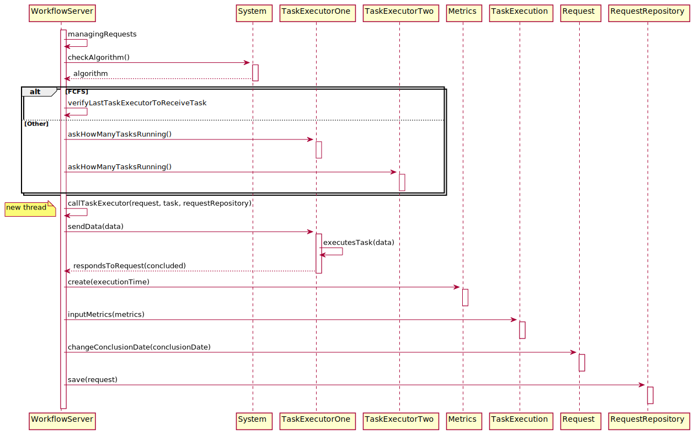
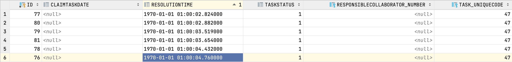

# US4071_Algoritmo_de distribuição_das_tarefas_automáticas

=======================================

# 1. Requisitos

**UC 4.3.2** Como Gestor de Projeto, eu pretendo que seja desenvolvido e integrado no Motor de Fluxos de Atividades  algoritmos que distribuam a realização de tarefas automáticas pelas diversas instâncias do Executor de Tarefas Automáticas existentes na infraestrutura instalada.

A interpretação feita deste requisito foi no sentido de a gestão do executor de tarefas esta melhor distribuído podendo adotar diferentes algoritmos.

# 2. Análise

**Pré-Análise** - É necessário estar implementado o gestor de fluxos de atividade juntamente com o executor de tarefas.

Deverão ser implementados dois algoritmos diferentes, um baseado em First Came First Served e outro que tenha em consideração a disponibilidade das respetivas instâncias e a carga atual das mesmas. O algoritmo que o sistema deve utilizar deve ser definido por configuração.

**Pós-Análise** - Estaram disponíveis dois tipos de algoritmos para a distribuição de tarefas automáticas no sistema.

# 3. Design

Para responder a este problema é necessário aquando da inicialização do gestor de fluxos de atividade definir qual o algoritmo que deverá ser utilizado usando as propriedades do sistem. Após isso quando o gestor encontra uma tarefa automática que precisa de ser executada então o gestor de fluxos verifica qual o algoritmo definido e se for o First Came First Server, então o gestor vai mandar o pedido para o executor de tarefas que não fez uma tarefa à mais tempo, se for o outro algoritmo então ele vai mandar uma mensagem a cada executor de tarefas qual o número de tarefas que ele está a correr, aquele que tiver menos fará então a tarefa automática. Após este processo o gestor de fluxos atualiza o tempo de execução da tarefa e da o pedido como terminado.  

## 3.1. Realização da Funcionalidade

## 3.2. Diagrama de Classes

*Nesta secção deve apresentar e descrever as principais classes envolvidas na realização da funcionalidade.*

## 3.3. Padrões Aplicados

Repository e Create

## 3.4. Estudo
*Nesta secção deve sistematizar como os testes foram concebidos para permitir uma correta aferição da satisfação dos requisitos.*

Para realizar o estudo deste US foram executados 6 pedidos de um serviço com uma tarefa automática ao mesmo tempo, e foram usados primeiro o algoritmo de estilo First Come First Served onde foi obtido os seguintes resultados:

**FCFS**

A resolutiontime apresenta a data 1970-01-01 01:00:-- pois é a maneira como o nosso programa interpreta o tempo guardado, ou seja o valor que cada tarefa demorou a executar foi:

 ID da Tarefa | Tempo (segundos)
---------|---------
 76 | 4.760
 77 | 2.824
 78 | 4.432
 79 | 3.519
 80 | 2.882
 81 | 3.654

Se calcularmos a média do tempo de exexcução de uma tarefa obtemos o valor 3.679.

Quando executamos as mesmas tarefas mas desta vez para o outro algoritmo que gere a carga de cada taskexecutor obtemos os seguintes resultados:

**Other**

 A resolutiontime apresenta a data 1970-01-01 01:00:-- pois é a maneira como o nosso programa interpreta o tempo guardado, ou seja o valor que cada tarefa demorou a executar foi:

 ID da Tarefa | Tempo (segundos)
---------|---------
 76 | 2.509
 77 | 3.979
 78 | 2.030
 79 | 4.165
 80 | 1.923
 81 | 2.890

 Se calcularmos a média do tempo de exexcução de uma tarefa obtemos o valor 2.916.

 Conseguimos então perceber que o algoritmo que o segundo algoritmo é mais eficiente na atribuição de tarefas cerca de 20%.

# 4. Implementação

*Nesta secção a equipa deve providenciar, se necessário, algumas evidências de que a implementação está em conformidade com o design efetuado. Para além disso, deve mencionar/descrever a existência de outros ficheiros (e.g. de configuração) relevantes e destacar commits relevantes;*

*Recomenda-se que organize este conteúdo por subsecções.*

# 5. Integração/Demonstração

*Nesta secção a equipa deve descrever os esforços realizados no sentido de integrar a funcionalidade desenvolvida com as restantes funcionalidades do sistema.*

# 6. Observações

*Nesta secção sugere-se que a equipa apresente uma perspetiva critica sobre o trabalho desenvolvido apontando, por exemplo, outras alternativas e ou trabalhos futuros relacionados.*
