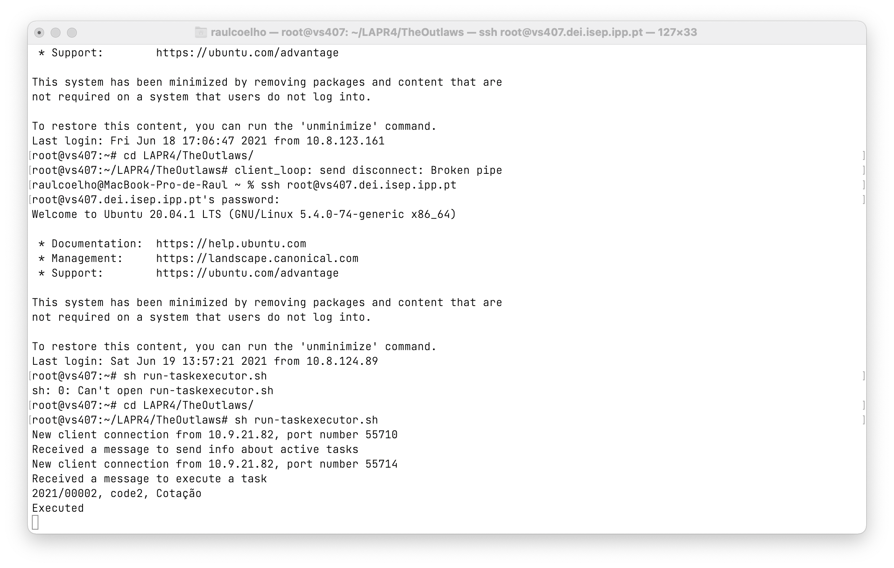

# US5003_Conclusão do executor de tarefas automáticas

=======================================

# 1. Requisitos

**UC 4.3.2** Como Gestor de Projeto, eu pretendo que a equipa conclua o desenvolvimento do Executor de Tarefas Automáticas tornando-o bastante robusto.
 * Refinar US 5001.
 * As expressões da linguagem/gramática desenvolvida devem ser executadas/interpretadas (e.g. script de tarefa automática).

A interpretação feita deste requisito foi no sentido de serem realizadas tarefas com o carácter automático sem intervenção de nenhum utilizador.

# 2. Análise

**Pré-Análise:**
- A aplicação terá de ser capaz de comunicar entre Motor de Fluxo de Atividades e o Executor de Tarefas Automáticas.
- É necessária a existência de tarefas de carácter automático para poderem ser executadas pelo sistema.

O sistema irá procurar as tarefas registadas como automáticas prontas a ser realizadas e realiza-las sem a intervenção de nenhum utilizador, sendo executada apenas pelo Executor de Tarefas Automáticas.
A partilha de informação é assegurada pela utilização de uma mensagem de pedido, seguido da receção de uma mensagem de resposta. Estas transações são realizadas através de uma ligação TCP, estabelecida segundo o modelo cliente-servidor.

Para identificar-mos o tipo de pedido/resposta entre as aplicações seguimos a seguinte tabela:

| Código  | Significado |
|---------|-------------|
| 0       | Teste - Pedido de teste sem qualquer efeito para além da devolução de uma resposta com código 2. Este pedido não transporta dados |
| 1       | Fim - Pedido de fim de ligação. O servidor deve devolver uma resposta com código 2, após o que ambas as aplicações devem fechar a ligação TCP |
| 2       | Entendido - Resposta vazia (não transporta dados) que acusa a receção de um pedido. É enviada em resposta a pedidos com código 0 e código 1, mas poderá ser usada em outros contextos |
| 5       | Envia os dados do Fluxo de Atividades para o Executor de Tarefas Automáticas |
| 6       | Envia os dados para a dashbord |
| 10      | Solicita os dados relativos ao estado do Fluxo de Atividades |
| 11      | Solicita os dados relativos à dashbord |
| 20      | Solicita o número de Tarefas existentes no Executor de Tarefas Automáticas |
| 21      | Envia um pedido para executar uma Tarefa Automática |
| 255     | Segmento - identifica os dados transportados como sendo uma parte de um conjunto de dados mais extenso. Este código é usado para transferir volumes de dados superiores a 255 bytes. Nesse cenário um pedido ou uma resposta pode ser constituído por uma sequência de mensagens com código 255 finalizada por uma mensagem contendo um código diferente de 255. |

**Pós-Análise:**
- Tarefas pendentes com um carácter automático serão realizadas sem intervenção de nenhum colaborador.

# 3. Design

O Executor de Tarefas Automáticas funcionará como um servidor ligado aplicação do Motor do Fluxo de Atividades, estabelecendo uma ligação de servidor-servidor. O Executor será executado de forma continua, procurando por mensagens de pedido por parte da aplicação do Motor de Fluxos de Atividades.

O Motor procura tarefas de carácter automática no estado de *Submited* e *Approved* e envia a sua informação para o Executor de Tarefas Automáticas através das do uso das mensagens de pedido com o código 5 *(envia os dados do Fluxo de Atividades para o Executor de Tarefas Automáticas)*.

Ao receber essa informação, o Executor de Tarefas Automáticas irá executar o *Script* que acompanha a tarefa, seguindo-se o envio da mensagem de resposta de volta para o Motor de Fluxo de Atividades.  

- Excerto do Protocolo de Comunicação

## 3.1. Realização da Funcionalidade

## 3.2. Diagrama de Classes

## 3.3. Padrões Aplicados

## 3.4. Testes

Tomamos como exemplo o pedido com o código único **2021/0002**. Este encontra-se no *status* 0 e possui uma tarefa automática a ser executada com o ID **78**.
- 

	

O Executor de Tarefas Automáticas é capaz de reconhecer a tarefa automática e executar o solicitado. Antes da sua execução informa o código do pedido sobre o qual está a executar, o código único e o título do serviço.

- 

Após a execução da tarefa automática, esta é dada como concluída e é guardada a sua data de conclusão.

- 

# 4. Implementação

*Nesta secção a equipa deve providenciar, se necessário, algumas evidências de que a implementação está em conformidade com o design efetuado. Para além disso, deve mencionar/descrever a existência de outros ficheiros (e.g. de configuração) relevantes e destacar commits relevantes;*

*Recomenda-se que organize este conteúdo por subsecções.*

# 5. Integração/Demonstração

*Nesta secção a equipa deve descrever os esforços realizados no sentido de integrar a funcionalidade desenvolvida com as restantes funcionalidades do sistema.*

# 6. Observações

*Nesta secção sugere-se que a equipa apresente uma perspetiva critica sobre o trabalho desenvolvido apontando, por exemplo, outras alternativas e ou trabalhos futuros relacionados.*
