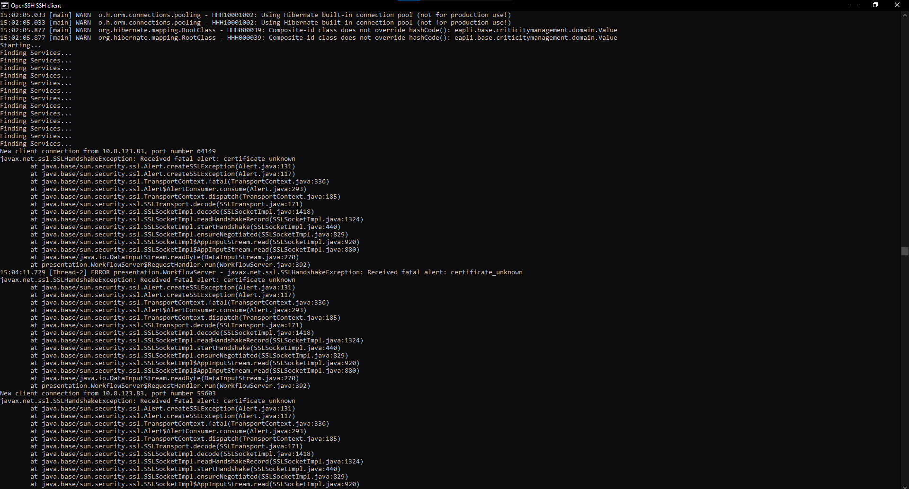

# US3101_Protocolo_de_Comunicação_Workflow_Servidor
=======================================

# 1. Requisitos

Como Gestor de Projeto, eu pretendo que as comunicações realizadas através do protocolo SDP2021 estejam protegidas.

A interpretação feita deste requisito foi no sentido de todas as comunicações da aplicaçãos portal devem estar protegidas com a aplicação de SSL/TLS com autenticação mútua.

# 2. Análise

**Pré-Análise** - É necessário estar implementado a aplicação Portal de Utilizadores capaz de interagir com os utilizadores.

Deverão ser implementada o serviço de SSL/TLS nas comunicações TCP entre as diversas aplicações em que o programa utilize a aplicação Portal dos Utilizadores.

**Pós-Análise** - As comunicações entre aplicações estará protegida.
# 3. Design

Para responder a este problema foi usada a tecnologia SSL/TLS para que a comunicação entre as diversas aplicações esteja protegida por autenticação mútua. Para tal foi necessário gerar um certificado/key para a aplicação na aplicação Portal dos Utilizadores que atua como cliente.

## 3.1. Realização da Funcionalidade

É necessário alterar as propriedades da aplicação indicando-lhe a localização do certificado do servidor como também a password para aceder a esse mesmo certificado.

	private static final String TRUSTED_STORE="SSL/client1_J.jks";
	private static final String KEYSTORE_PASS="forgotten";

	// Trust these certificates provided by authorized clients
  	System.setProperty("javax.net.ssl.trustStore", TRUSTED_STORE);
  	System.setProperty("javax.net.ssl.trustStorePassword",KEYSTORE_PASS);

  	// Use this certificate and private key as server certificate
  	System.setProperty("javax.net.ssl.keyStore",TRUSTED_STORE);
  	System.setProperty("javax.net.ssl.keyStorePassword",KEYSTORE_PASS);

## 3.2. Diagrama de Classes

*Nesta secção deve apresentar e descrever as principais classes envolvidas na realização da funcionalidade.*

## 3.3. Padrões Aplicados

SSL/TLS

## 3.4. Testes
Para testar esta funcionalidade é necessário correr o programa como um cliente não permitido pelo servidor, quando isto acontece o servidor apresenta que o certificado do cliente é desconhecido através do erro certificate_unknown e nem sequer chega a aparecer a dashboard ao colaborador como podemos ver abaixo:

Se a conexão for feita por um cliente válido com um certificado a operação corre segundo planeado e no exemplo que usamos a informação que o cliente pede ao servidor é enviada pelo servidor e apresentada na dashboard:

# 4. Implementação

*Nesta secção a equipa deve providenciar, se necessário, algumas evidências de que a implementação está em conformidade com o design efetuado. Para além disso, deve mencionar/descrever a existência de outros ficheiros (e.g. de configuração) relevantes e destacar commits relevantes;*

*Recomenda-se que organize este conteúdo por subsecções.*

# 5. Integração/Demonstração

*Nesta secção a equipa deve descrever os esforços realizados no sentido de integrar a funcionalidade desenvolvida com as restantes funcionalidades do sistema.*

# 6. Observações

*Nesta secção sugere-se que a equipa apresente uma perspetiva critica sobre o trabalho desenvolvido apontando, por exemplo, outras alternativas e ou trabalhos futuros relacionados.*
