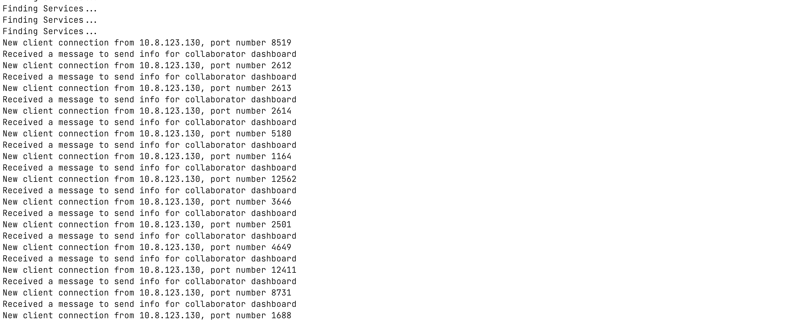

# US5002_Protocolo_de_Comunicação
=======================================

# 1. Requisitos

Como Gestor de Projeto, eu pretendo que as comunicações realizadas através do protocolo SDP2021 estejam protegidas.

A interpretação feita deste requisito foi no sentido todas as comunicações das aplicações realizadas através do protocolo SDP2021 com o Executor de Tarefas Automáticas devem estar protegidas com a aplicação de SSL/TLS com autenticação mútua.

# 2. Análise

**Pré-Análise** - É necessário estar implementado o Executor de Tarefas Automáticas capaz de receber mensagens do Motor de Fluxos de Atividades.

Deverão ser implementada o serviço de SSL/TLS nas comunicações TCP entre as diversas aplicações em que o programa atue como servidor.

**Pós-Análise** - As comunicações com o Executor de Tarefas Automáticas estarão protegidas.

# 3. Design

Para responder a este problema foi usada a tecnologia SSL/TLS para que a comunicação entre as diversas aplicações esteja protegida por autenticação mútua. Para tal foi necessário gerar um certificado/key para cada aplicação quando esta trabalha como cliente ou servidora. Com esta tecnologia implementada torna-se impossível fazer ligações aos servidores quando o cliente não tem uma chave registada neste.

## 3.1. Realização da Funcionalidade

## 3.2. Diagrama de Classes

## 3.3. Padrões Aplicados

SSL/TLS

## 3.4. Testes

Para testar esta funcionalidade é necessário correr o programa como um cliente não permitido pelo servidor, quando isto acontece o servidor apresenta que o certificado do cliente é desconhecido através do erro certificate_unknown como podemos ver abaixo:

Se a conexão for feita por um cliente válido com um certificado a operação corre segundo planeado e no exemplo que usamos a informação que o cliente pede ao servidor é enviada pelo servidor:

# 4. Implementação

*Nesta secção a equipa deve providenciar, se necessário, algumas evidências de que a implementação está em conformidade com o design efetuado. Para além disso, deve mencionar/descrever a existência de outros ficheiros (e.g. de configuração) relevantes e destacar commits relevantes;*

*Recomenda-se que organize este conteúdo por subsecções.*

# 5. Integração/Demonstração

*Nesta secção a equipa deve descrever os esforços realizados no sentido de integrar a funcionalidade desenvolvida com as restantes funcionalidades do sistema.*

# 6. Observações

*Nesta secção sugere-se que a equipa apresente uma perspetiva critica sobre o trabalho desenvolvido apontando, por exemplo, outras alternativas e ou trabalhos futuros relacionados.*
