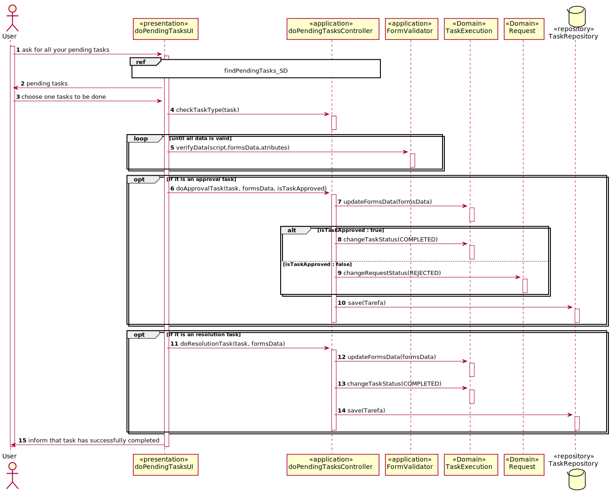
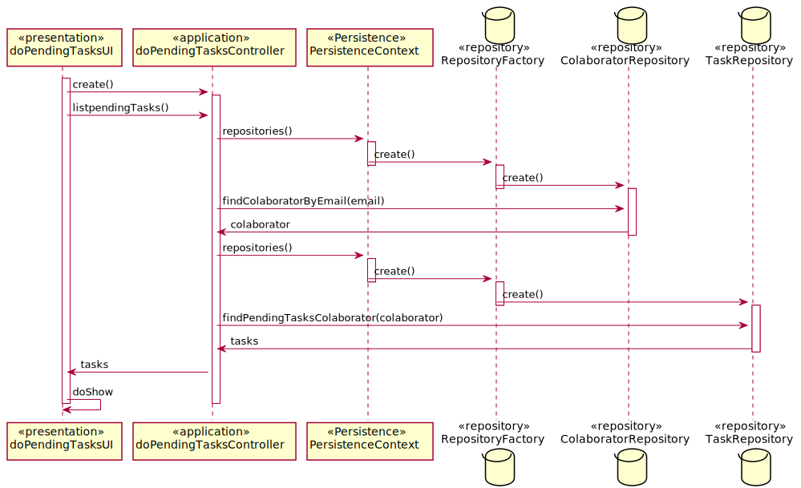
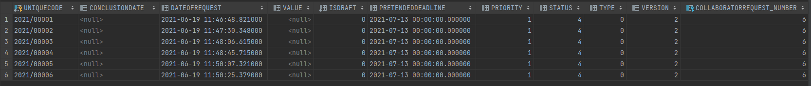
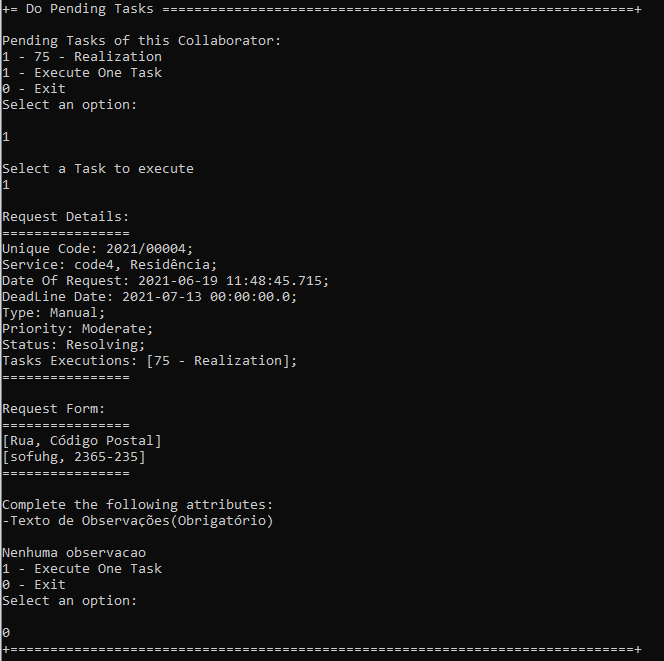
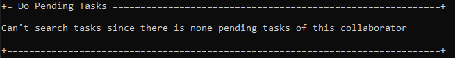
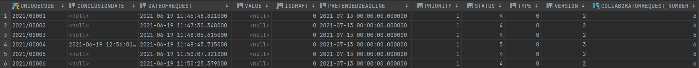

# US3023_RealizarTarefaPendente
=======================================

# 1. Requisitos

Como utilizador, eu pretendo realizar uma tarefa que tenho como pendente.
A realização deste requesito consiste nos seguintes passos:

- Consultar toda a informação disponível até ao momento no pedido em causa;
- Realizar algo fora do controlo do sistema em desenvolvimento (e.g., verificar elegibilidade do requerente, atuar sobre um sistema externo);
- Responder/Completar o formulário associada à respetiva tarefa, caso exista;
- Dar a tarefa por concluída, devendo o sistema garantir que os dados do formulário que foi respondido são todos válidos.
- As expressões da linguagem/gramática desenvolvida devem ser executadas/interpretadas (e.g. validação do formulário associado).

A interpretação feita deste requisito foi no sentido de um Colaborador com sessão iniciada no sistema pudesse consultar quais as suas tarefas/pedidos pendentes e os pudesse realizar segundo as normas expressas em cima.

# 2. Análise

**Pré-Análise** - É necessário a existência de tarefas pendentes assignadas ao colaborador que tem sessão iniciada no sistema.

A realização das tarefas assignadas a um colaborador pode ser feito manualmente pelo próprio colaborador (utilizador), que usa o seu menu para dar login no sistema e seguidamente pode proceder a sua realização. O Colaborador (utilizador) antes de realizar a sua tarefa tem a sua disposição um lista de tarefas pendentes da qual pode escolher a que quer ver resolvida. Depois de escolhida a tarefa é lhe apresentada toda a informação útil da mesma e de seguida o colaborador procede com a resposta ao formulário dessa tarefa.

**Pós-Análise** - Será mostrado na consola ao utilizador a tarefa que ele acabou de resolver com o status alterado para "concluída".

# 3. Design

Para responder a este problema foi usado o padrão Controller para criar o controlador DoPendingTasksController. Este controlador é responsável pela listagem das tarefas pendentes de um utilizador e realização das mesmas. Para persistir esta informação no sistema é usado o padrão Repository. O controlador usa CollaboratorRepository  e TaskRepository para obter a informação necessária para listagem das tarefas pendentes.

## 3.1. Realização da Funcionalidade

### References

* FindPendingTasks_SD 

## 3.2. Diagrama de Classes

*Nesta secção deve apresentar e descrever as principais classes envolvidas na realização da funcionalidade.*

## 3.3. Padrões Aplicados

Create e Repository

## 3.4. Testes

### Caso de Sucesso/esperado:
Como utilizador, eu devo dar login na aplicação portal e escolher a opção para executar uma tarefa. Seguidamente deverá ser-me apresentada a lista com todas as minhas tarefas pendentes ou uma frase a dizer que eu não tenho tarefas pendentes, na qual eu posso escolher uma tarefa para a executar. Depois da tarefa escolhida ira ser mostrado os detalhes relacionados ao pedido dessa tarefa, bem como o formulário e as resposta a esse mesmo formulário do pedido e da tarefa de aprovação, caso esta ultima exista. No final disso deverá ser me apresentada a opção de saída desse menu onde consta também a opção de executar outra tarefa pendente caso eu como utilizador assim o deseje. Por fim deve ficar registado na base de dados a data de Conclusão dessa tarefa

### Resultado obtido na execução do programa:

###### Base de Dados antes da execução da tarefa

###### Execução da Tarefa  

###### Base de Dados antes da execução da tarefa

### Conclusão
Tal como podemos observar nas imagens representativas da execução do programa acima o caso de sucesso verifica-se pelo que o teste é verdadeiro

# 4. Implementação

*Nesta secção a equipa deve providenciar, se necessário, algumas evidências de que a implementação está em conformidade com o design efetuado. Para além disso, deve mencionar/descrever a existência de outros ficheiros (e.g. de configuração) relevantes e destacar commits relevantes;*

*Recomenda-se que organize este conteúdo por subsecções.*

# 5. Integração/Demonstração

*Nesta secção a equipa deve descrever os esforços realizados no sentido de integrar a funcionalidade desenvolvida com as restantes funcionalidades do sistema.*

# 6. Observações

*Nesta secção sugere-se que a equipa apresente uma perspetiva critica sobre o trabalho desenvolvido apontando, por exemplo, outras alternativas e ou trabalhos futuros relacionados.*
