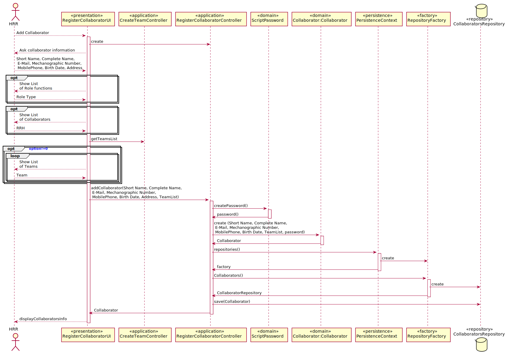

# US2051_RegistarColaborador
=======================================

# 1. Requisitos

Como Responsável de Recursos Humanos (RRH), eu pretendo proceder à especificação de um novo colaborador de modo a que este possa, posteriormente, aceder e usar o sistema.

A interpretação feita deste requisito foi no sentido de especificar no sistema a existência de um novo colaborador

# 2. Análise

O Registo de um colaborador pode ser feito manualmente por um Responsável de Recursos Humanos (RRH) 	que usa o seu menu para definir a existência de um novo colaborador ou pode ser importada informação de um ficheiro de texto (e.g. formato CSV) gerado por um
sistema externo. O Responsável de Recursos Humanos (RRH) ao criar um colaborador pode associa-lo a uma equipa ou a várias(caso seja a várias tem de se garantir que são de tipos diferentes), para além disso tem de definir também o seu número mecanográfico, nome curto (i.e., pelo qual é comummente tratado), nome completo, data de nascimento, local
de residência, endereço de email institucional, número de contacto (e.g. telemóvel, telefone),
pela função que desempenha e, caso exista, pela indicação de quem é o seu responsável
hierárquico atual na organização (i.e., outro colaborador). O numero mecanográfico do colaborador é único.

# 3. Design

Para responder a este problema foi usado o padrão Controller para criar o controlador AddCollaboratorController. Este controlador é responsável pelo tratamento do processo de criação de um novo colaborador no sistema. Este controlador por sua vez faz uso da classe collaborator para criar uma instância de colaborador. Para persistir esta informação no sistema é usado o padrão Repository. O controlador usa CollaboratorRepository para guardar a informação em base de dados.

Tendo em conta que um colaborador pode ter um responsável RH e que pode ter uma função associada a si controller vai buscar qual a função e qual o Responsável RH do colaborador para que o Responsável RH decida quais os aplicáveis a este Colaborador. Quando este escolher e introduzir os dados necessários então será criado um novo Colaborador.

## 3.1. Realização da Funcionalidade

## 3.2. Diagrama de Classes

*Nesta secção deve apresentar e descrever as principais classes envolvidas na realização da funcionalidade.*

## 3.3. Padrões Aplicados

Controler e Repository

## 3.4. Testes

**Teste 1 a 7:** Verificar que não é possível criar uma instância da classe Collaborator com valores nulos em número mecanográfico, nome curto, nome completo, data de nascimento, local
de residência, endereço de email institucional, número de contacto.

	@Test(expected = IllegalArgumentException.class)
		public void ensureCollaboratorCantHaveNull<xField>() {
		Collaborator instance = new Collaborator(every field not null except xField);
	}

**Teste 8:** Verificar que não é possível criar uma instância da classe Collaborator sem o nome curto obedecer às restrições aplicadas pelo cliente.

	public boolean ensureNomeCurtoMeetsCorrectSize(String nomeCurto){
			if(nomeCurto <= 30){
				return true;
			}else{
				return false;
			}
	}

**Teste 9:** Verificar que não é possível criar uma instância da classe Collaborator sem o nome completo obedecer às restrições aplicadas pelo cliente.

	public boolean ensureNomeCompletoMeetsCorrectSize(String nomeCompleto){
			if(nomeCompleto <= 80){
				return true;
			}else{
				return false;
			}
	}

# 4. Implementação

*Nesta secção a equipa deve providenciar, se necessário, algumas evidências de que a implementação está em conformidade com o design efetuado. Para além disso, deve mencionar/descrever a existência de outros ficheiros (e.g. de configuração) relevantes e destacar commits relevantes;*

*Recomenda-se que organize este conteúdo por subsecções.*

# 5. Integração/Demonstração

*Nesta secção a equipa deve descrever os esforços realizados no sentido de integrar a funcionalidade desenvolvida com as restantes funcionalidades do sistema.*

# 6. Observações

*Nesta secção sugere-se que a equipa apresente uma perspetiva critica sobre o trabalho desenvolvido apontando, por exemplo, outras alternativas e ou trabalhos futuros relacionados.*
