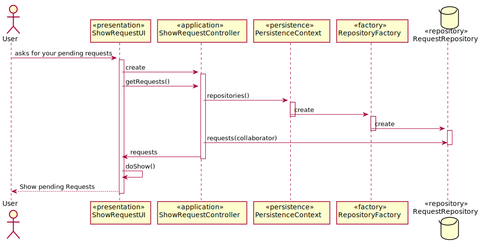
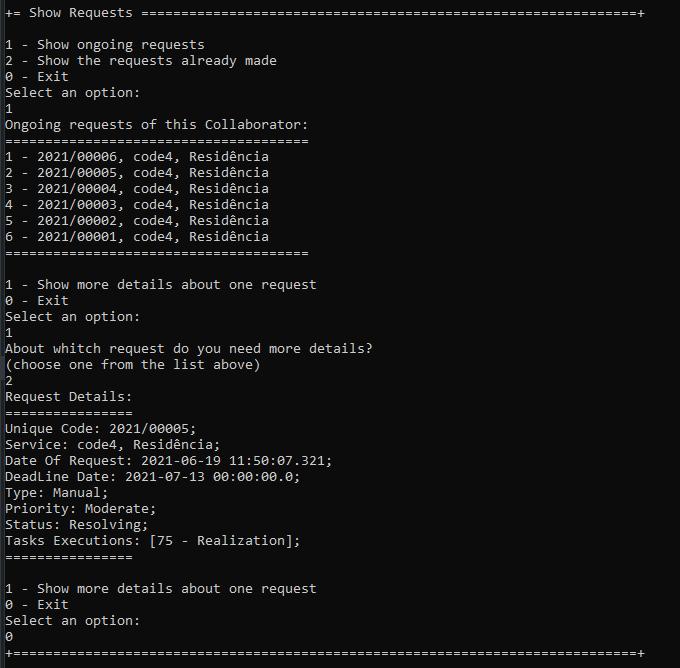
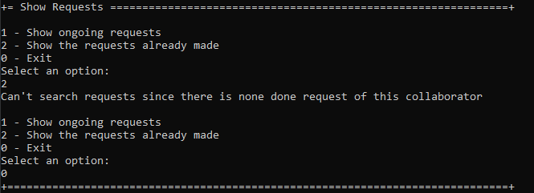

# US3031Consultar_Pedidos
=======================================

# 1. Requisitos

Como utilizador, eu pretendo consultar os meus pedidos (em curso ou o histórico) e respetivos detalhes/estado.

- Separados entre (i) em curso e (ii) histório.
- Devem estar ordenados dos mais recentes para os mais antigos.
- Deve permitir consultar os detalhes de um pedido em especifico

A interpretação feita deste requisito foi no sentido de apresentar ao colaborador todos os seus pedidos bem como alguma informação adicional dos mesmos

# 2. Análise

**Pré-Análise** - É necessário a existência de pedidos no sistema assignados ao colaborador que tem sessão iniciada no sistema.

A consulta dos pedidos assignadas a um colaborador pode ser feito manualmente pelo próprio colaborador (utilizador), que usa o seu menu para dar login no sistema e seguidamente proceder a consulta dos seus pedidos. O Colaborador (utilizador) ao consultar os seus pedidos tem uma imediata perceção de todos os pedidos que já executou e dos que ainda estão em curso, sendo que todos eles se encontraram ordenados por data de modo a tornar mais fácil essa visualização. Além disso um colaborador pode ainda escolher um determinado pedido e ver todas as informações adicionais relacionadas com o mesmo.

**Pós-Análise** - Será mostrado na consola ao utilizador os seus pedidos (em curso ou o histórico).

# 3. Design

Para responder a este problema foi usado o padrão Controller para criar o controlador ShowRequestsController. Este controlador é responsável pelo tratamento do processo de pesquisa de todos os pedidos de um colaborador (Utilizador) no sistema. Este controlador por sua vez faz uso da classe Request para ter acesso a todos os dados do pedido. Para persistir esta informação no sistema é usado o padrão Repository. O controlador usa RequestRepository para guardar a nova informação em base de dados.

O sistema poderá possuir vários pedidos, pelo que o controller irá buscar todos esses valores e disponibiliza-los ao utilizador de modo ordenado através das datas de maneira a facilitar a visualização do utilizador bem como uma possivel escolha de um pedido para obter mais informações. No processo de escolha de um pedido, o utilizador irá escolher um da lista apresentada, sendo o controller responsável por obter o objeto da classe Request e apresentar todos os dados referentes ao mesmo ao utilizado.

## 3.1. Realização da Funcionalidade

## 3.2. Diagrama de Classes

*Nesta secção deve apresentar e descrever as principais classes envolvidas na realização da funcionalidade.*

## 3.3. Padrões Aplicados

Controller e Repository

## 3.4. Testes

#### Caso de Sucesso/esperado:
Como utilizador, eu devo dar login na aplicação portal e escolher a opção para mostrar os meus pedidos e depois disso escolher se quero ver os pedidos pendentes ou os pedidos já realizados. Seguidamente deverá ser-me apresentada a lista com todos os meus pedidos da categoria escolhida ou uma frase a dizer que não há pedidos que se enquadrem nessa categoria, na qual eu posso escolher um pedido para ver os detalhes do mesmo. No final disso deverá ser me apresentada a opção de saída desse menu onde consta também a opção de procurar por outro pedido caso eu como utilizador assim o pretenda

#### Resultado obtido na execução do programa:

#### Conclusão
Tal como podemos observar nas imagens representativas da execução do programa acima o caso de sucesso verifica-se pelo que o teste é verdadeiro

# 4. Implementação

*Nesta secção a equipa deve providenciar, se necessário, algumas evidências de que a implementação está em conformidade com o design efetuado. Para além disso, deve mencionar/descrever a existência de outros ficheiros (e.g. de configuração) relevantes e destacar commits relevantes;*

*Recomenda-se que organize este conteúdo por subsecções.*

# 5. Integração/Demonstração

*Nesta secção a equipa deve descrever os esforços realizados no sentido de integrar a funcionalidade desenvolvida com as restantes funcionalidades do sistema.*

# 6. Observações

*Nesta secção sugere-se que a equipa apresente uma perspetiva critica sobre o trabalho desenvolvido apontando, por exemplo, outras alternativas e ou trabalhos futuros relacionados.*
