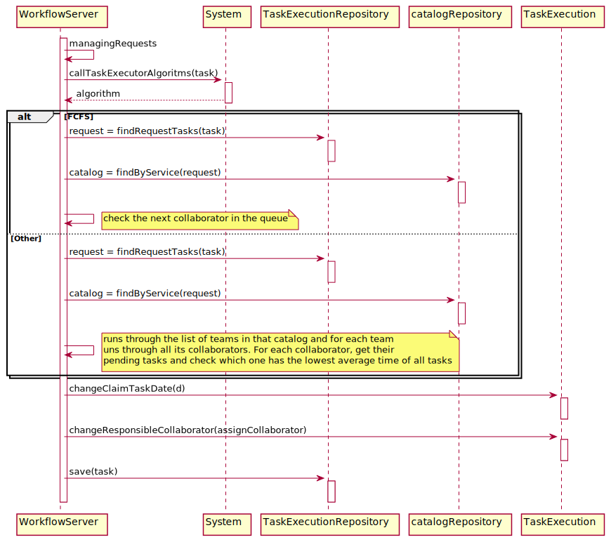
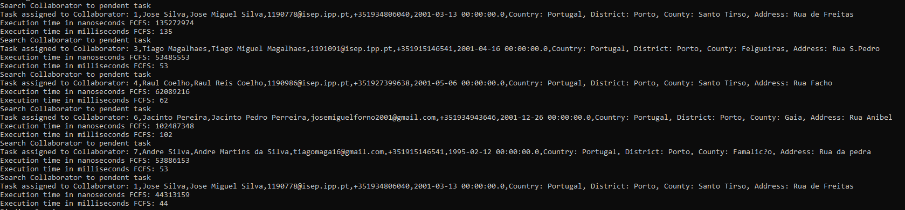
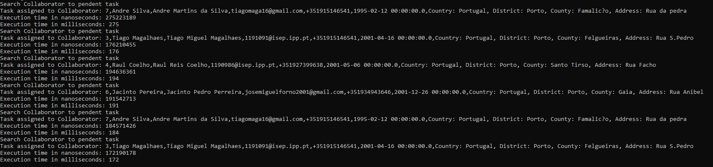

# US4072_Algoritmo_de_atribuição_das_tarefas_automáticas
=======================================

# 1. Requisitos

Como Gestor de Projeto, eu pretendo que seja desenvolvido e integrado no Motor de Fluxos de Atividades algoritmos que assignem automáticamente tarefas a colaboradores de forma a evitar que essas tarefas tenham que ser reivindicadas pelos mesmos.

- Pretende-se que sejam desenvolvidos dois algoritmos distintos:
 - 1) baseado em First Came First Served (entre colaboradores de cada equipa);
 - 2) outro que, no âmbito de cada equipa, considere a quantidade de tarefas pendentes dos colaboradores e o tempo médio de execução de cada uma das tarefas (pré-definido em cada tarefa).

O uso ou não de um destes algoritmo e qual o algoritmo a usar deve ser configurável no sistema.
A interpretação feita deste requisito foi no sentido de o servidor distribuir pelos diferentes colaboradores as tarefas que lhe sao pedidas.

# 2. Análise

**Pré-Análise** - É necessário estar implementado o gestor de fluxos de atividade.

Deverão ser implementados dois algoritmos diferentes, um baseado em First Came First Served e outro que tenha em consideração o tempo medio de execução de cada tarefa. O algoritmo que o sistema deve utilizar deve ser definido por configuração nas propriedades do sistema logo aquando da sua inicialização.

**Pós-Análise** - Estaram disponíveis dois tipos de algoritmos para a atribuição de tarefas automáticas no sistema.

# 3. Design

Para responder a este problema é necessário aquando da inicialização do gestor de fluxos de atividade definir qual o algoritmo que deverá ser utilizado usando as propriedades do sistema. Após isso quando o gestor encontra uma tarefa que não esteja assignada a nenhum colaborador então o gestor de fluxos verifica qual o algoritmo definido e se for o First Came First Server, então o gestor vai assignar o pedido ao colaborador não fez uma tarefa à mais tempo, se for o outro algoritmo então ele vai verificar qual o colaborador que tem o menor tempo médio de execução de tarefas assignado a si e atribui a esse colaborador. Após este processo o gestor de fluxos atualiza o colaborador assignado a essa tarefa.  

## 3.1. Realização da Funcionalidade

## 3.2. Diagrama de Classes

## 3.3. Padrões Aplicados

## 3.4. Testes/Estudo
Para realizar o estudo deste US foram executados 6 pedidos de um serviço com uma tarefa manual ao mesmo tempo, e foram usados primeiro o algoritmo de estilo First Come First Served onde foi obtido os seguintes resultados:

**FCFS**

Nesta tabela podemos observar melhor os tempos que este algoritmo demorou a fazer a sua execução.

 Pedido | Tempo (milisegundos)
---------|---------
 1 | 135
 2 | 53
 3 | 62
 4 | 102
 5 | 53
 6 | 44

Se calcularmos a média do tempo de atribuição de uma tarefa obtemos o valor 74.8 milisegundos.

Quando executamos as mesmas tarefas mas desta vez para o outro algoritmo que gere a carga de cada colaborador no momento da atribuição obtemos os seguintes resultados:

**Other**

Nesta tabela podemos observar melhor os tempos que este algoritmo demorou a fazer a sua execução.

 ID da Tarefa | Tempo (segundos)
---------|---------
 1 | 275
 2 | 176
 3 | 194
 4 | 191
 5 | 184
 6 | 172

 Se calcularmos a média do tempo de atribuição de uma tarefa obtemos o valor 198 milisegundos.

#### Conclusão
 Conseguimos então perceber que o primeiro algoritmo é mais eficiente na atribuição de tarefas cerca de 37%. Contudo o segundo algoritmo é mais eficiente na divisão de cargas entre os colaboradores uma vez que os deixa "de igual para igual" uns com os outros.

# 4. Implementação

*Nesta secção a equipa deve providenciar, se necessário, algumas evidências de que a implementação está em conformidade com o design efetuado. Para além disso, deve mencionar/descrever a existência de outros ficheiros (e.g. de configuração) relevantes e destacar commits relevantes;*

*Recomenda-se que organize este conteúdo por subsecções.*

# 5. Integração/Demonstração

*Nesta secção a equipa deve descrever os esforços realizados no sentido de integrar a funcionalidade desenvolvida com as restantes funcionalidades do sistema.*

# 6. Observações

*Nesta secção sugere-se que a equipa apresente uma perspetiva critica sobre o trabalho desenvolvido apontando, por exemplo, outras alternativas e ou trabalhos futuros relacionados.*
