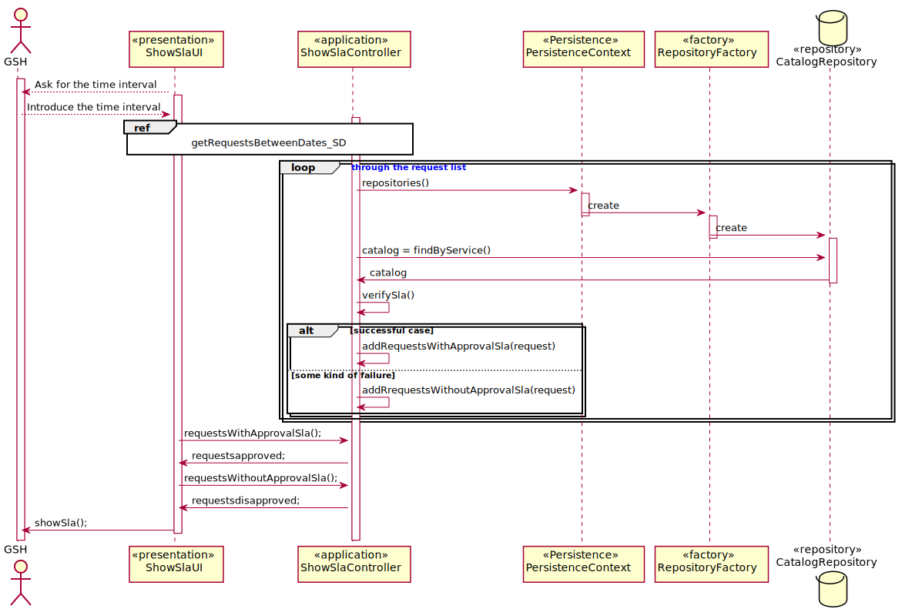
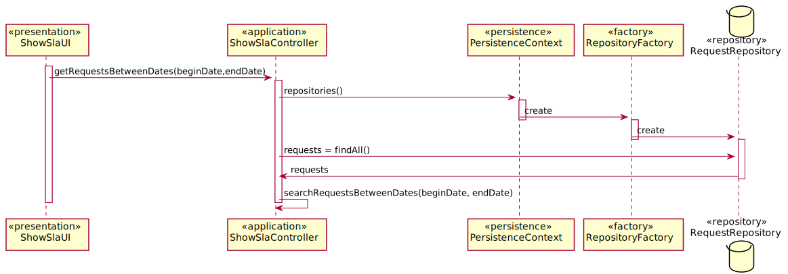
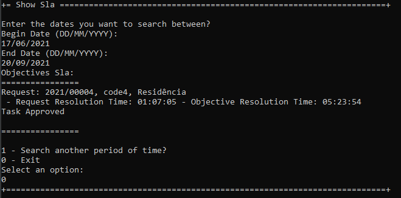
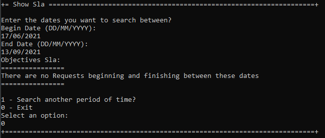

# US2013_ConsultarObjetivosSLa
=======================================

# 1. Requisitos

Como GSH, eu pretendo obter uma listagem sobre o (in)cumprimento do SLA das solicitações recebidas e já concluídas num determinado intervalo de tempo.

A interpretação feita deste requisito foi no sentido de apresentar ao gestor um listagem das estatísticas do cumprimento ou não dos objetivos de SLa de uma determinada tarefa/pedido

# 2. Análise

**Pré-Análise** - É necessário a existência de pedidos/tarefas no sistema assignados a um ou mais colaboradores.

A consulta da listagem das estatísticas de SLa pode ser feito manualmente pelo próprio gestor, que usa o seu menu para dar login no sistema e seguidamente proceder a consulta dessa mesma listagem. O Gestor ao consultar a sua listagem tem imediata perceção do cumprimento ou não dos objetivos de Sla assignados a qualquer colaborador existente no sistema e que por sua vez tenham realizado uma tarefa/pedido. Esta listagem é apresentada ao gestor de modo a que o mesmo consiga ter acesso a todos os dados de Sla (e.g Tempo médio de aprovação, Tempo médio de Resolução, Tempo máximo de Resolução, etc).

**Pós-Análise** - Será mostrado na consola ao gestor toda a listagem dos objetivos Sla assignados a todos os colaboradores do sistema.

# 3. Design

Para responder a este problema foi usado o padrão Controller para criar o controlador ShowSlaController. Este controlador é responsável pela listagem dos objetivos Sla dos pedidos. Para persistir esta informação no sistema é usado o padrão Repository. O controlador usa CatalogRepository  e RequestRepository para obter a informação necessária para listagem dos Sla.

O sistema poderá possuir vários requests, pelo que o controller irá buscar todos esses valores e logo em seguida verificar quais desses valores estão entre as datas escolhidas pelo gestor.
Depois de ter apenas os requests que o gestor pretendia o controller verifica se estes cumprem os objetivos dos Sla e retorna a informação de quais cumprem ou não esses requisitos à UI que por sua vez os mostra ao gestor

## 3.1. Realização da Funcionalidade

### References

* GetRequestsBeetweenDates_SD 

## 3.2. Diagrama de Classes

## 3.3. Padrões Aplicados

Controller Repository

## 3.4. Testes

#### Caso de Sucesso/esperado:
Como utilizador, eu devo dar login na aplicação portal e escolher a opção mostrar os objetivos Sla das tarefa. Seguidamente ser-me-á pedido que introduza uma data de começo e fim dessa mesma pesquisa. Depois de introduzida essa informação será apresentada a lista com todas as tarefas concluídas e ainda com informação do tempo que decorreu a sua execução e ainda o tempo máximo que era suposto cumprir nessa mesma execução ou então uma mensagem a avisar que nesse intervalo de tempo não existe nenhuma tarefa concluída. Para alem disso será dito se a tarefa cumpriu ou não os objetivos. No final disso deverá ser me apresentada a opção de saída desse menu onde consta também a opção de procurar por outro período de tempo caso eu como utilizador assim o deseje.

#### Resultado obtido na execução do programa:

#### Conclusão
Tal como podemos observar nas imagens representativas da execução do programa acima o caso de sucesso verifica-se pelo que o teste é verdadeiro

# 4. Implementação

*Nesta secção a equipa deve providenciar, se necessário, algumas evidências de que a implementação está em conformidade com o design efetuado. Para além disso, deve mencionar/descrever a existência de outros ficheiros (e.g. de configuração) relevantes e destacar commits relevantes;*

*Recomenda-se que organize este conteúdo por subsecções.*

# 5. Integração/Demonstração

*Nesta secção a equipa deve descrever os esforços realizados no sentido de integrar a funcionalidade desenvolvida com as restantes funcionalidades do sistema.*

# 6. Observações

*Nesta secção sugere-se que a equipa apresente uma perspetiva critica sobre o trabalho desenvolvido apontando, por exemplo, outras alternativas e ou trabalhos futuros relacionados.*
