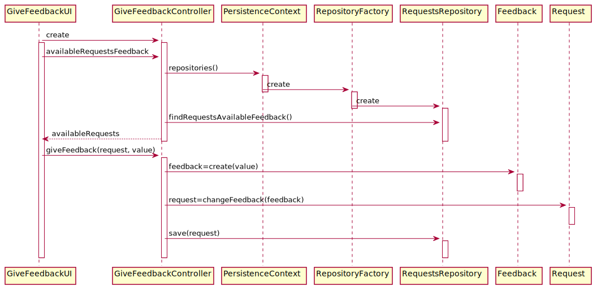

# US3051_Registar_Feedback
=======================================

# 1. Requisitos

**UC 4.2.4** Como utilizador, eu pretendo transmitir o meu grau de satisfação sobre a resolução de um dado pedido por mim efetuado.

A interpretação feita deste requisito foi no sentido de um utilizador, após o termino de um pedido, fornecer um feedback sobre a realização desse pedido.

# 2. Análise

**Pré-Análise** - É necessário estar implementado o catálogo com serviços e ter sido feito um pedido pelo utilizador que já tenha sido realizado.

O utilizador usa o seu menu para definir que quer atribuir um feedback a um pedido qe tenha feito. Será mostrado os pedidos que este tenha feito que tenham sido realizados à menos de 7 dias(valor configurável) devendo este escolher um e atribuir-lhe uma classificação de 0 a 5.

**Pós-Análise** - O feedback será guardado no sistema associado ao pedido escolhido.

# 3. Design

*Nesta secção a equipa deve descrever o design adotado para satisfazer a funcionalidade. Entre outros, a equipa deve apresentar diagrama(s) de realização da funcionalidade, diagrama(s) de classes, identificação de padrões aplicados e quais foram os principais testes especificados para validar a funcionalidade.*

*Para além das secções sugeridas, podem ser incluídas outras.*

Para responder a este problema foi usado o padrão Controller para criar o controlador GiveFeedbackController. Este controlador é responsável pelo tratamento do processo de alteração de um pedido, mais concretamente do seu feedback no sistema. Este controlador por sua vez faz uso da classe Feedback para criar uma instância de feedback e faz também uso da classe Pedido para alterar o seu devido feedback. Para persistir esta informação no sistema é usado o padrão Repository. O controlador usa RequestRepository para alterar a informação em base de dados.

Tendo em conta que o feedback apenas pode ser dado se um pedido se este tiver sido concluído e se tiver sido concluído à menos de sete dias, daí o controlador ter de ir buscar apenas os pedidos que estão aptos a receber feedback. Quando este escolher e introduzir os dados necessários então será criado um novo feedback e atribuído ao pedido escolhido.

## 3.1. Realização da Funcionalidade

## 3.2. Diagrama de Classes

*Nesta secção deve apresentar e descrever as principais classes envolvidas na realização da funcionalidade.*

## 3.3. Padrões Aplicados

Controller, Repository e Create.

## 3.4. Testes
*Nesta secção deve sistematizar como os testes foram concebidos para permitir uma correta aferição da satisfação dos requisitos.*

**Teste 1:** Verificar que não é possível criar uma instância da classe Feedback com valores menores que 0.

	@Test(expected = IllegalArgumentException.class)
    public void ensureFeedbackCantBeLowerThan0(){
        Feedback feedback = new Feedback(-3);
    }

**Teste 2:** Verificar que não é possível criar uma instância da classe Feedback com valores maiores que 5.

    @Test(expected = IllegalArgumentException.class)
    public void ensureFeedbackCantBeHigherThan5(){
        Feedback feedback = new Feedback(7);
    }

# 4. Implementação

*Nesta secção a equipa deve providenciar, se necessário, algumas evidências de que a implementação está em conformidade com o design efetuado. Para além disso, deve mencionar/descrever a existência de outros ficheiros (e.g. de configuração) relevantes e destacar commits relevantes;*

*Recomenda-se que organize este conteúdo por subsecções.*

# 5. Integração/Demonstração

*Nesta secção a equipa deve descrever os esforços realizados no sentido de integrar a funcionalidade desenvolvida com as restantes funcionalidades do sistema.*

# 6. Observações

*Nesta secção sugere-se que a equipa apresente uma perspetiva critica sobre o trabalho desenvolvido apontando, por exemplo, outras alternativas e ou trabalhos futuros relacionados.*
