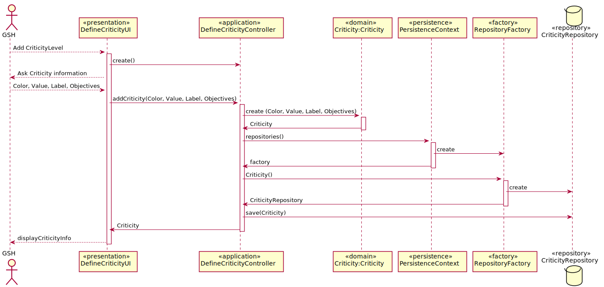

# US2010_DefinirNiveisCriticidade
=======================================

# 1. Requisitos

Como Gestor de Serviços de Help desk (GSH), eu pretendo definir os níveis de criticidade e respetivos objetivos aplicados na organização para definição de SLAs.

A interpretação feita deste requisito foi no sentido de especificar os níveis de criticidade aplicados na organização em SLAs

# 2. Análise

A especificação do níveis de criticidade aplicados na organização em SLAs é feita pelo Gestor de Serviços de Help desk (GSH) que usa o seu menu para definir esses mesmos níveis bem como informação relevante aos mesmos. O Gestor de Serviços de Help desk (GSH) ao  especificar um nível de criticidade tem também de definir uma etiqueta (e.g. baixa, média, elevada), um valor numa escala numérica de inteiros, uma cor indicativa de gravidade e respetivos objetivos(e.g., os tempos máximos e médios a serem
satisfeitos tanto na aprovação como na resolução de uma solicitação com este nível de criticidade).

# 3. Design

Para responder a este problema foi usado o padrão Controller para criar o controlador DefineCriticityController. Este controlador é responsável pelo tratamento do processo de criação de um novo nivel de criticidade no sistema. Este controlador por sua vez faz uso da classe Criticity para criar uma instância de Criticity. Para persistir esta informação no sistema é usado o padrão Repository. O controlador usa CriticityRepository para guardar a informação em base de dados.

## 3.1. Realização da Funcionalidade

## 3.2. Diagrama de Classes

*Nesta secção deve apresentar e descrever as principais classes envolvidas na realização da funcionalidade.*

## 3.3. Padrões Aplicados

Controler e Repository

## 3.4. Testes
*Nesta secção deve sistematizar como os testes foram concebidos para permitir uma correta aferição da satisfação dos requisitos.*

**Teste 1 a 4:** Verificar que não é possível criar uma instância da classe Criticity com valores nulos em values, label, objectives, colors.
de residência, endereço de email institucional, número de contacto.

	@Test(expected = IllegalArgumentException.class)
		public void ensureCriticityCantHaveNull<xField>() {
		Criticity instance = new Criticity(every field not null except xField);
	}

	**Teste 5 a 7:** Verificar que não é possível criar uma instância da classe TeamType com valores red, green e blue acima de 255.

			@Test(expected = IllegalArgumentException.class)
				public void ensureCriticityCantHaveNull<xField>() {
				Criticity instance = new Criticity(every field not null and xField over 255);
			}

	**Teste 8 a 10:** Verificar que não é possível criar uma instância da classe TeamType com valores red, green e blue abaixo de 0.

			@Test(expected = IllegalArgumentException.class)
				public void ensureCriticityCantHaveNull<xField>() {
				Criticity instance = new Criticity(every field not null and xField under 255);
			}

# 4. Implementação

*Nesta secção a equipa deve providenciar, se necessário, algumas evidências de que a implementação está em conformidade com o design efetuado. Para além disso, deve mencionar/descrever a existência de outros ficheiros (e.g. de configuração) relevantes e destacar commits relevantes;*

*Recomenda-se que organize este conteúdo por subsecções.*

# 5. Integração/Demonstração

*Nesta secção a equipa deve descrever os esforços realizados no sentido de integrar a funcionalidade desenvolvida com as restantes funcionalidades do sistema.*

# 6. Observações

*Nesta secção sugere-se que a equipa apresente uma perspetiva critica sobre o trabalho desenvolvido apontando, por exemplo, outras alternativas e ou trabalhos futuros relacionados.*
