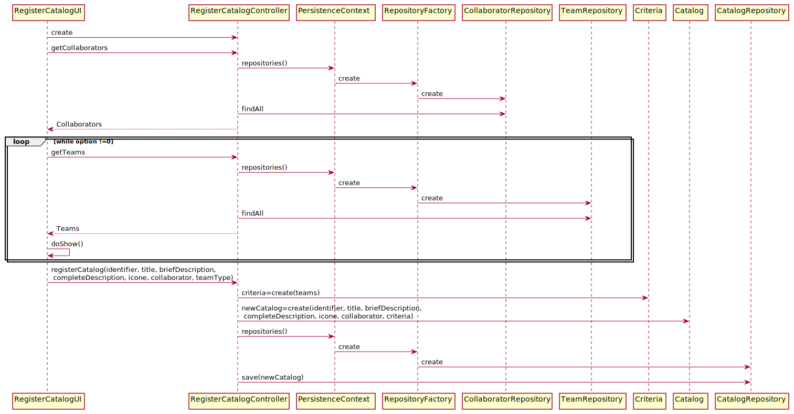

# US2001_Registar um Catalogo
=======================================

# 1. Requisitos

**UC 4.1.6** Como Gestor de Serviços de Help desk (GSH), eu pretendo criar um novo catálogo de serviços.

A interpretação feita deste requisito foi no sentido de especificar no sistema a existência de um novo catálogo de serviços.

# 2. Análise

O gestor de Serviços de Help desk (GSH) usa o seu menu para definir a existência de um novo catálogo.  O utilizador pode criar um catálogo devendo associar um identificador, um título, uma descrição breve e outra completa, um ícone e deve ainda indicar qual o colaborador responsável pela sua gestão. O utilizador deve ainda especificar os critérios de quem tem acesso aos serviços posteriormente contidos no catálogo.

O identificador do catálogo é único.
A descrição breve pode ter no máximo 40 caracteres e a descrição completa 100.

# 3. Design

Para responder a este problema foi usado o padrão Controller para criar o controlador RegisterCatalogController. Este controlador é responsável pelo tratamento do processo de criação de um novo catálogo no sistema. Este controlador por sua vez faz uso da classe Catalog para criar uma instância de catálogo. Para persistir esta informação no sistema é usado o padrão Repository. O controlador usa CatalogRepository para guardar a informação em base de dados.

Tendo em conta que um catálogo tem um colaborador que é responsável por este mesmo e tem também conjunto de equipas que poderá realizar os seus serviços o controller vai buscar quais os colaboradores e as equipas disponíveis para que o gestor decida quais os aplicáveis a este catálogo. Quando este escolher e introduzir os dados necessários então será criado um novo catálogo.

## 3.1. Realização da Funcionalidade

## 3.2. Diagrama de Classes

*Nesta secção deve apresentar e descrever as principais classes envolvidas na realização da funcionalidade.*

## 3.3. Padrões Aplicados

Controller e Repository

## 3.4. Testes
*Nesta secção deve sistematizar como os testes foram concebidos para permitir uma correta aferição da satisfação dos requisitos.*

**Teste 1 a 5:** Verificar que não é possível criar uma instância da classe Catalog com valores nulos em title, briefDescription, completeDescription, icon.

	@Test(expected = IllegalArgumentException.class)
		public void ensureCatalogCantHaveNull<xField>() {
		Exemplo instance = new Exemplo(every field not null except xField);
	}

**Teste 6:** Verificar que não é possível criar uma instância da classe Catalog sem a briefDescription obedecer às restrições aplicadas pelo cliente.

	@Test(expected = IllegalArgumentException.class)
	public void ensureCatalogCantHaveBriefDescriptionOversize(){
		  Catalog instance = new Catalog(...,briefDescription over 40,...);
	}

**Teste 7** Verificar que não é possível criar uma instância da classe Catalog sem a completeDescription obedecer às restrições aplicadas pelo cliente.

	@Test(expected = IllegalArgumentException.class)
	public void ensureCatalogCantHaveCompleteDescriptionOversize(){
			Catalog instance = new Catalog(...,completeDescription over 100,...);
	}

**Teste 8** Verificar que não é possível criar uma instância de Criteria com valores Null.

	@Test(expected = IllegalArgumentException.class)
	public void ensureCriteriaHasNoNullFields(){
			Criteria instance = new Criteria(null);
	}

# 4. Implementação

*Nesta secção a equipa deve providenciar, se necessário, algumas evidências de que a implementação está em conformidade com o design efetuado. Para além disso, deve mencionar/descrever a existência de outros ficheiros (e.g. de configuração) relevantes e destacar commits relevantes;*

*Recomenda-se que organize este conteúdo por subsecções.*

# 5. Integração/Demonstração

*Nesta secção a equipa deve descrever os esforços realizados no sentido de integrar a funcionalidade desenvolvida com as restantes funcionalidades do sistema.*

# 6. Observações

*Nesta secção sugere-se que a equipa apresente uma perspetiva critica sobre o trabalho desenvolvido apontando, por exemplo, outras alternativas e ou trabalhos futuros relacionados.*
