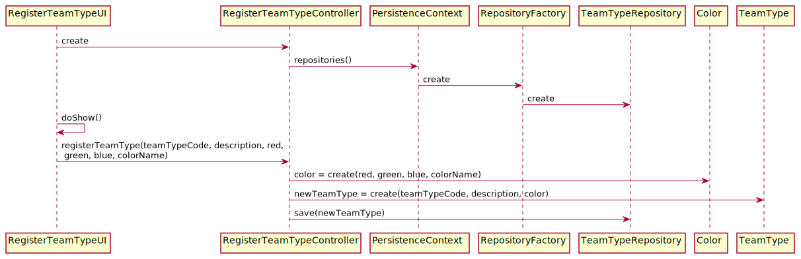

# US2054_Registar Tipo de Equipa
=======================================

# 1. Requisitos

**UC 4.1.1** Como RRH, eu pretendo registar um novo tipo de equipa.

A interpretação feita deste requisito foi no sentido de especificar no sistema a existência de um novo tipo de equipa.

# 2. Análise

O registo de um novo tipo de equipa deve ser feito manualmente por um Responsável de Recursos Humanos (RRH), que deve usar o menu para associar uma descrição, uma cor e um código único interno que serão posteriormente adotados pelas equipas deste tipo.

A descrição pode ter no máximo 50 caracteres.
A cor é constituída por 4 valores, o nome, o valor de vermelho, verde e azul, sendo que estes vão de 0 a 255.

# 3. Design

Para responder a este problema foi usado o padrão Controller para criar o controlador RegisterTeamTypeController. Este controlador é responsável pelo tratamento do processo de criação de um novo tipo de equipa no sistema. Este controlador por sua vez faz uso da classe TeamType para criar uma instância de tipo de equipa e da classe Color para criar a cor associada ao tipo de equipa. Para persistir esta informação no sistema é usado o padrão Repository. O controlador usa TeamTypeRepository para guardar a informação em base de dados.

## 3.1. Realização da Funcionalidade

*Nesta secção deve apresentar e descrever o fluxo/sequência que permite realizar a funcionalidade.*

## 3.2. Diagrama de Classes

*Nesta secção deve apresentar e descrever as principais classes envolvidas na realização da funcionalidade.*

## 3.3. Padrões Aplicados

Controller e Repository

## 3.4. Testes
*Nesta secção deve sistematizar como os testes foram concebidos para permitir uma correta aferição da satisfação dos requisitos.*

**Teste 1 a 2:** Verificar que não é possível criar uma instância da classe TeamType com valores nulos em teamTypeCode, description.

	@Test(expected = IllegalArgumentException.class)
		public void ensureTeamTypeCantHaveNull<xField>() {
		TeamType instance = new TeamType(every field not null except xField);
	}

s

# 4. Implementação

*Nesta secção a equipa deve providenciar, se necessário, algumas evidências de que a implementação está em conformidade com o design efetuado. Para além disso, deve mencionar/descrever a existência de outros ficheiros (e.g. de configuração) relevantes e destacar commits relevantes;*

*Recomenda-se que organize este conteúdo por subsecções.*

# 5. Integração/Demonstração

*Nesta secção a equipa deve descrever os esforços realizados no sentido de integrar a funcionalidade desenvolvida com as restantes funcionalidades do sistema.*

# 6. Observações

*Nesta secção sugere-se que a equipa apresente uma perspetiva critica sobre o trabalho desenvolvido apontando, por exemplo, outras alternativas e ou trabalhos futuros relacionados.*
