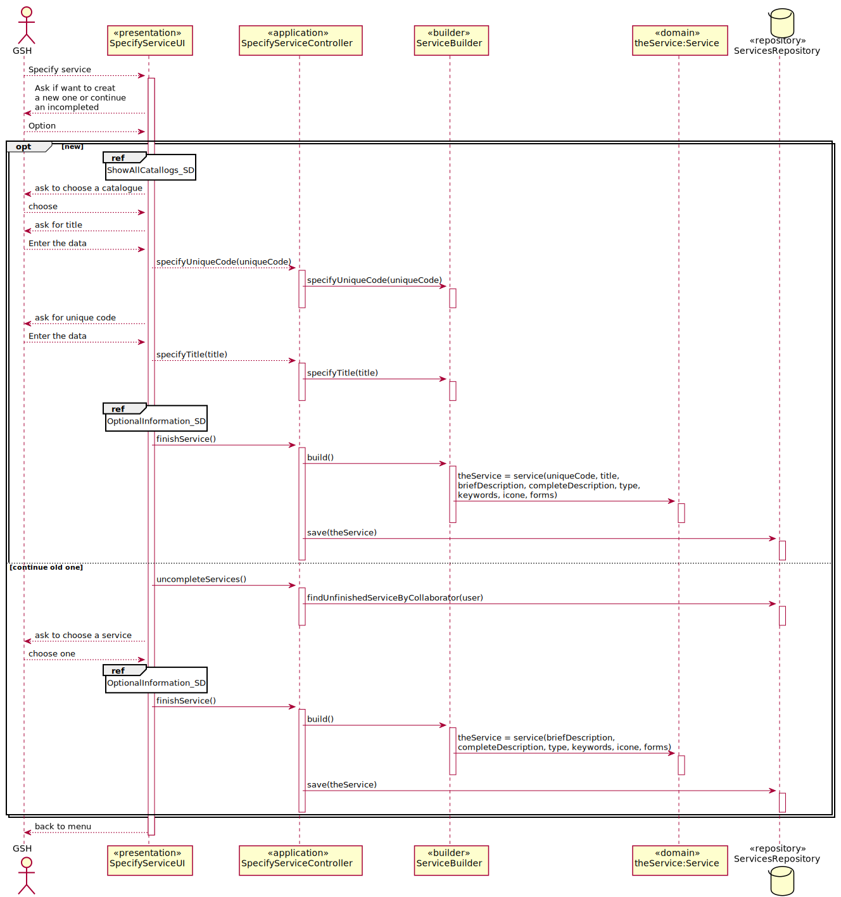
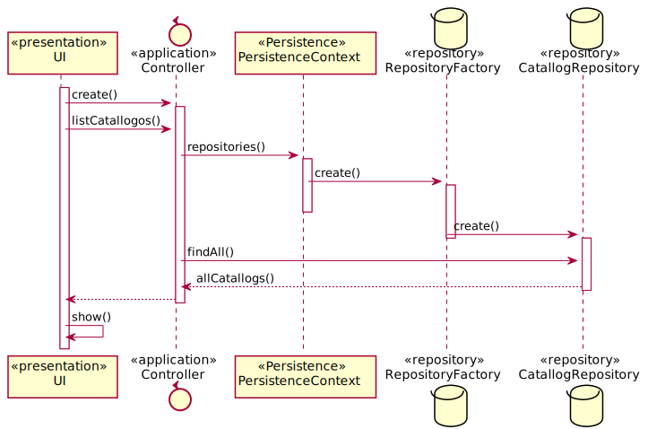
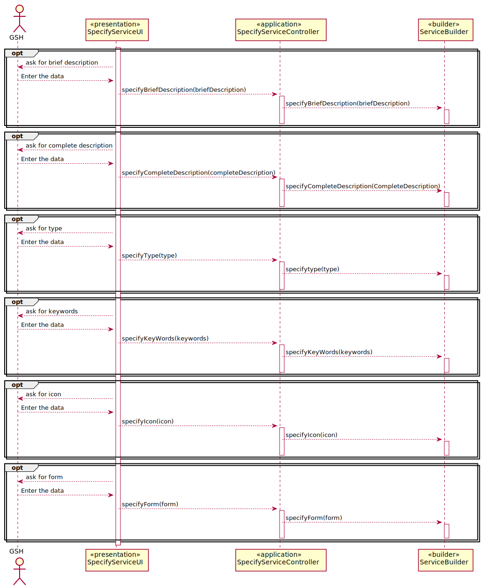

# US2002_Especificação de serviço

=======================================

# 1. Requisitos

**UC 4.1.7** Como GSH, eu pretendo proceder à especificação de um novo serviço, devendo o sistema permitir que a mesma fique incompleta e seja, posteriormente, retomada.

- O serviço só deve ficar disponível para solicitação quando a sua especificação ficar completa e válida.

- O serviço possui uma informação base (código, descrição, catálogo onde será disponibilizado, formulários, requer feedback).

- O serviço possui um formulário de solicitação do serviço e/ou um formulário de uma atividade manual

	- Cada formulário tem um identificador único no âmbito do serviço, um nome e uma lista de atributos a solicitar ao colaborador

	- Exemplo de tipos de dados a considerar nos formulários: Inteiro, String, Bool, Data, Ficheiro, ListaDeValores (Enumerado) e uma expressão regular que permita a sua validação
local. O formulário deve ainda ter associado um script que permita proceder à sua validação.

- A atividade de aprovação do serviço, podendo esta ser requerida ou não. De momento apenas é necessária contemplar a aprovação pelo responsável hierárquico direto do solicitante e/ou pelo responsável do serviço em causa.

- A atividade referente ao serviço pode ser feita em diferentes momentos espaçados no tempo. Nesse sentido, a especificação pode num dado momento ficar incompleta e ser, posteriormente, continuada/completada.

A interpretação feita deste requisito foi no sentido de possibilitar a existência de serviços posteriormente armazenados no sistema, podendo estes estar completos ou incompletos.

# 2. Análise

Na especificação de um serviço, o utilizador deverá preencher tanto os requisitos base como os especiais, transitando esta para o estado de válido para se proceder à sua execução. O serviço transitará entre fases de incompleta e completa ao longo do tempo.

# 3. Design

*Nesta secção a equipa deve descrever o design adotado para satisfazer a funcionalidade. Entre outros, a equipa deve apresentar diagrama(s) de realização da funcionalidade, diagrama(s) de classes, identificação de padrões aplicados e quais foram os principais testes especificados para validar a funcionalidade.*

*Para além das secções sugeridas, podem ser incluídas outras.*

## 3.1. Realização da Funcionalidade

### References

* ShowAllCatallogs_SD 

* OptionalInformation_SD 

## 3.2. Diagrama de Classes

*Nesta secção deve apresentar e descrever as principais classes envolvidas na realização da funcionalidade.*

## 3.3. Padrões Aplicados

Controller, Builder e Repository

## 3.4. Testes

**Teste 1 a 2:** Verificar que não é possível criar uma instância da classe Service com valores nulos em title e uniqueCode.

	@Test(expected = IllegalArgumentException.class)
		public void ensureCatalogCantHaveNull<xField>() {
		Exemplo instance = new Exemplo(every field not null except xField);
	}

**Teste 3:** Verificar que não é possível criar uma instância da classe Service sem o uniqueCode obedecer às restrições aplicadas pelo cliente.

	@Test(expected = IllegalArgumentException.class)
	public boolean ensureUniqueCodeMeetsCorrectSize(String uniqueCode){
		if(uniqueCode <= 15){
			return true;
		}else{
			return false;
		}
	}

# 4. Implementação

*Nesta secção a equipa deve providenciar, se necessário, algumas evidências de que a implementação está em conformidade com o design efetuado. Para além disso, deve mencionar/descrever a existência de outros ficheiros (e.g. de configuração) relevantes e destacar commits relevantes;*

*Recomenda-se que organize este conteúdo por subsecções.*

# 5. Integração/Demonstração

*Nesta secção a equipa deve descrever os esforços realizados no sentido de integrar a funcionalidade desenvolvida com as restantes funcionalidades do sistema.*

# 6. Observações

*Nesta secção sugere-se que a equipa apresente uma perspetiva critica sobre o trabalho desenvolvido apontando, por exemplo, outras alternativas e ou trabalhos futuros relacionados.*
