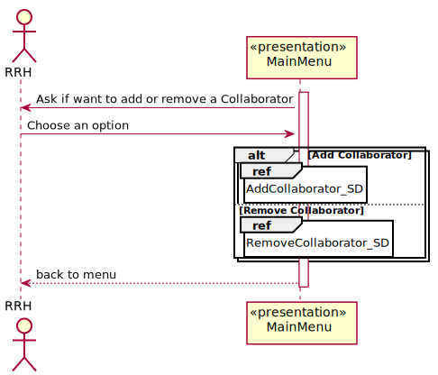
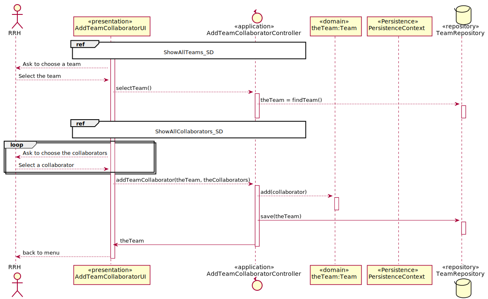
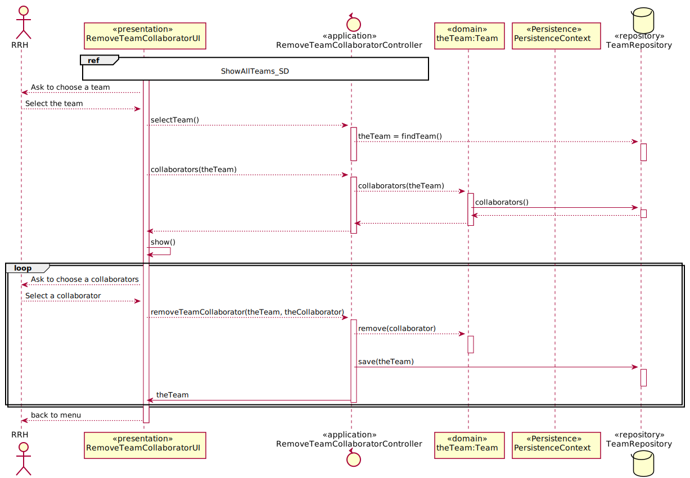
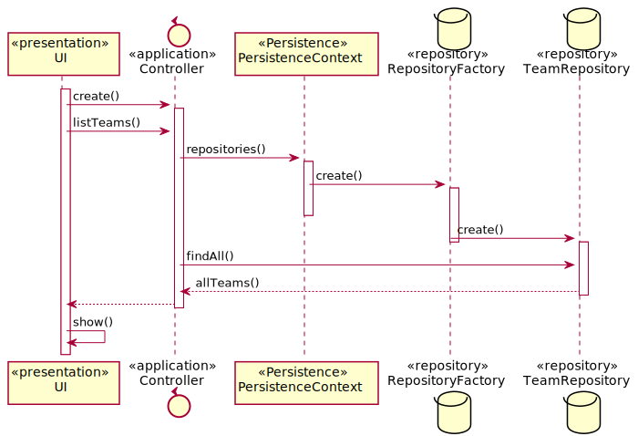
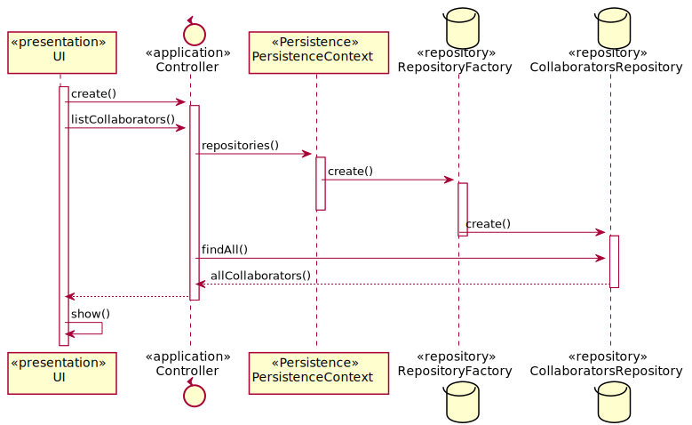

# US2053_Associar/Remover colaborador de uma equipa

=======================================

# 1. Requisitos

**UC 4.1.5** Como RRH, eu pretendo associar/remover um colaborador a uma equipa.

A interpretação feita deste requisito foi no sentido de possibilitar a existência ou não de um colaborador dentro de uma equipa uma vez q o mesmo pode variar entre equipas ao longo do tempo.

# 2. Análise

A informação relativa a um colaborador pode ficar desatualizada, entre ela a equipa a que o mesmo pertence. Desse modo, o colaborador poderá alterar nas suas informações a equipa a que o mesmo está associado.

# 3. Design

Para responder a este problema foi usado o padrão Controller para criar o controlador ChangeTeamCollaboratorController. Este controlador é responsável pelo tratamento do processo de associação ou remoção de um colaborador relativamente a uma equipa. Este controlador por sua vez faz uso da classe Team para alterar os colaboradores nela presentes. Para persistir esta informação no sistema é usado o padrão Repository. O controlador usa TeamRepository para guardar a nova informação em base de dados.

O sistema poderá possuir várias equipas, pelo que o controller irá buscar todos esses valores e disponibiliza-los ao utilizador de modo a facilitar a escolha da equipa a alterar. O utilizador poderá escolher entre a opção de adicionar colaboradores a uma equipa ou remove-los, comportando-se o sistema de duas formas diferentes.
No processo de adição, o utilizador irá digitar o número mecanográfico do colaborador a associar à equipa, sendo o controller responsável por obter o objeto da classe Collaborator e adiciona-lo à equipa, seguindo-se o armazenamento desta nova informação.
Já no processo de  remoção, o Controller irá acessar à classe Equipa e apresentar todos os colaboradores presentes nela, pedindo ao utilizador que selecione o colaborador a remover, atualizando e armazenando toda a informação no fim.

## 3.1. Realização da Funcionalidade

### References

* AddCollaborator_SD 

* RemoveCollaborator_SD 

* ShowAllTeams_SD 

* ShowAllCollaborators_SD 

## 3.2. Diagrama de Classes

*Nesta secção deve apresentar e descrever as principais classes envolvidas na realização da funcionalidade.*

## 3.3. Padrões Aplicados

Controller e Repository

## 3.4. Testes
*Nesta secção deve sistematizar como os testes foram concebidos para permitir uma correta aferição da satisfação dos requisitos.*

**Teste 1:** Verificar se o colaborador a adicionar na equipa existe na base de dados

	@Test(expected = IllegalArgumentException.class)
	public boolean verifyIfCollaboratorExist(Collaborator colab){
		if( collaboratorExist(colab) ){
			return true;
		}else{
			return false;
		}
	}

# 4. Implementação

*Nesta secção a equipa deve providenciar, se necessário, algumas evidências de que a implementação está em conformidade com o design efetuado. Para além disso, deve mencionar/descrever a existência de outros ficheiros (e.g. de configuração) relevantes e destacar commits relevantes;*

*Recomenda-se que organize este conteúdo por subsecções.*

# 5. Integração/Demonstração

*Nesta secção a equipa deve descrever os esforços realizados no sentido de integrar a funcionalidade desenvolvida com as restantes funcionalidades do sistema.*

# 6. Observações

*Nesta secção sugere-se que a equipa apresente uma perspetiva critica sobre o trabalho desenvolvido apontando, por exemplo, outras alternativas e ou trabalhos futuros relacionados.*
