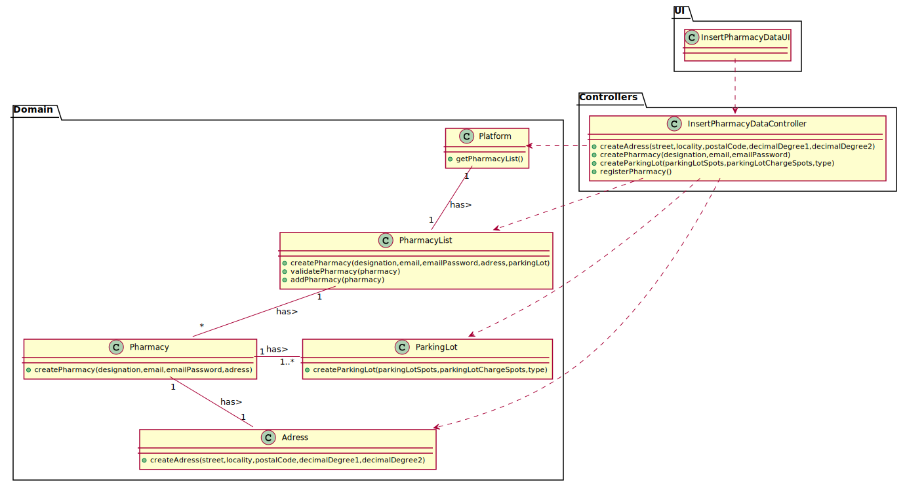
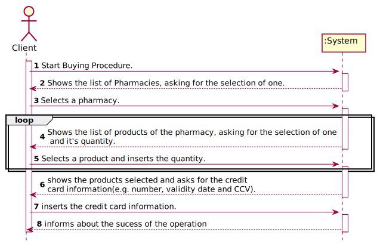
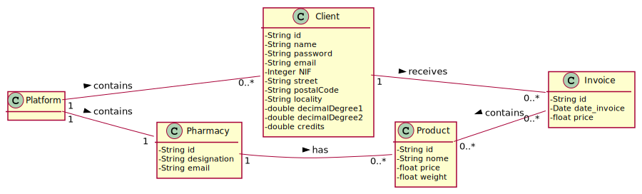
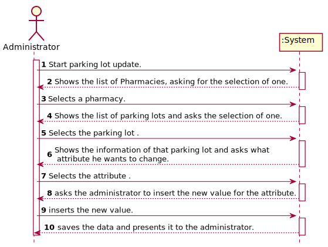

# README

This is the repository template used for student repositories in LAPR Projets.


## Students

Group: AUCKL3

Gonçalo Laranjeira Miranda 1190622

José Miguel Costa E Silva 1190778

José Miguel Fernandes Forno 1190780

Raúl Reis Coelho 1190986

Rui Pedro Sousa Silva Ribeiro 1191047

Sandro Emanuel Barraca Moura 1191051

Tiago Miguel Sampaio Magalhães 1191091


## Client ##

Nuno Bettencourt

## Course Unit ##

Laboratório/Projeto III

## 1. Introduction ##

This report has the purpose of describing the development process of the new
application for a pharmacy company, developed within the course unit of LAPR3.

 This application has the
objective of managing the products, clients, deliveries and orders of the company's pharmacies.

The main
objective of this project was for us to correctly apply the various concepts learned in this
semester on our different course units and give a perspective about what is like to work
in the job market.


In this report it will be shown the problem statement, in which the problem is
described and analysed, the planning and the methodology used to develop this
application and the proposed solution.


## 2. Problem statement

We were adressed by a Pharmacy Company, requesting  for the development of an application that allows the management of products, orders, deliveries and clients. The application should also allow the administrator to simulate the running costs of each delivery.

#### 2.1 Problem description(detailed)
It was solicited to us an aplication able to fulfil the following requests:

 * Clients must be able to register themselves. A registration is free but requires the client's adress.
 * For each purchase, an invoice must be issued and sent by email to the client.
 * Clients earn credits when buying online.
 * On every courier run, more than one order may be delivered.
 * And administrator should be able to remove, add, or update the scooter's list
 * The application should be able to estimate the amount of energy required to perform a delivery run.
 * The application should suggest the route that spends the least amount of energy.
 * When an electric scooter is parked it should send an email to the courier informing an estimate time for charging.
 * An administrator should be able to add, remove or update the list of drones.
 * The clients should receive a notification when a delivery run starts
 * A client can use it's credits to pay for an online delivery
 * When a pharmacy is out of stock, the application should verify the nearby pharmacies for available stock.
 * An administrator should be able to simulate the running costs of each delivery(air vs land)
 * An online order should be forwarded to the pharmacy that is nearer to the client's location


## 3. Work Organization, Planning and methodology

During this month there were 3 sprints(one week each) in which project was developed.

In each sprint we were asked to design and implement part of the final project. During each sprint we tried to get as many information as possible and clarify all possible doubts with the Client (by Zoom), in the project assignment and in the forum.

At the start of a sprint we did Sprint Planing in which we created the sprint backlog. This backlog had all the information we gathered. From this we then created User Stories, Tasks and Use Cases.

As a group, we distributed the tasks for that sprint for each member, having in account each others skills and habilities. Each day, at an hour agreed by all members, we did the Daily Scrum Meeting. In this meeting each member said what they had worked on that day, what they were going to do in the next day and what impediments they had.

At the end of each sprint there was a Sprint Review and a Sprint Retrospective in which all the group had to be present. On the review the group reviewed the project and looked for improvements and bugs that could make it into the following Sprint. On the retrospective we answered 3 questions. What went well, what went wrong and what we could do different on the next sprint.

Each member of the group was in charge of building the necessary diagrams for their UC'S using Visual Paradigm or PlantUML.

The tools we used in the development of our work were:

  * Bitbucket, where we had a repository with all our work.
  * SourceTree, which we used to “upload” our work to the repository and to
synchronize with each other’s work.
  * Discord, our main communication platform once we already used it. We also
found it easier to be in contact with each other while working in our “UC”’s.
  * Jenkins and SonarQube which we used to test and verify the quality of our program.
  * Jira, were we registered all our work and were we could see if we where working on the expectations.

# 4. Proposed Solution

# SPRINT 1

Sprint 1 - January 4th to January 10th

## Relational Model ##


# SPRINT 2

Sprint 2 - January 11th to January 17th

## Relational Model ##


# SPRINT 3

Sprint 3 - January 18th to January 26th

## Relational Model ##


# 4.1 Use Cases


## Use Case Diagram


***Add Scooter***


###### SSD

###### CD

###### SD

###### MD


***Remove Scooter***


###### SSD

###### CD

###### SD

###### MD


***Insert Pharmacy Data***


###### SSD

###### CD

###### SD

###### MD


***Register Scooter***


###### SSD

###### CD

###### SD

###### MD


***Execute a delivery***


###### SSD

###### CD

###### SD

###### CD


***Suggestion of the most economic route***

###### SD


***Calculate The Necessary Energy For Each Delivery***

###### SSD

###### CD

###### SD

###### MD


***Send an e-mail confirming that the scooter is charging and the estimated charge time***

###### SSD

###### CD

###### SD

###### MD


***Buy a Product***

###### SSD

###### CD

###### SD

###### MD



***Insert Data***

###### SSD

###### CD

###### SD


###### MD


***Insert Courier Data***

###### SSD

###### CD

###### SD

###### MD


***Update Stock***

###### SSD

###### CD

###### SD

###### MD


***Insert Product***

###### SSD

###### CD

###### SD

###### MD


***Edit parking lot characteristics***

###### SSD

###### CD

###### SD

###### MD


***Insert Parking Lot***

###### SSD

###### CD

###### SD

###### MD


***Register Drone***

###### SSD

###### CD

###### SD

###### MD


***Remove Drone From Pharmacy***

###### SSD

###### CD

###### SD

###### MD


***Notify Client***

###### SSD

###### SD

###### MD


***Make Drone Delivery***

###### SSD

###### CD

###### SD

###### MD


***Buy With Credits***

###### SSD

###### CD

###### SD

###### MD


***Remove Pharmacy From The List***

###### SSD

###### CD

###### SD

###### MD


***Choose The Pharmacy Closest To The Customer***

###### SSD

###### CD

###### SD

###### MD


***Simulate The Running Costs Of Each Delivery***

###### SSD

###### CD

###### SD

###### MD


# 5. Conclusion

With this project we got another glimpse of what real programming is and it's difficulties, even though the situation we are living made the work harder, our group did not struggle when it came to hard-work, communication and commitment. With this project we developed our group communication and our programming skills.

Dividing our work by use cases, according to methods learned on previous unit courses, made our work easier because we were able to analyse the requirements piece by piece instead of one big block of work. This gave us a perspective of how classes were connected in Java.

The Model–View–Controller and the GRASP (General Responsibility Assignment
Software Patterns) pattern as well as the object-oriented programming were the core
of this project and it made us all realise how vast the programming market can get.

Our first steps on the application-developing were made.

## Java source files

Java source and test files are located in folder src.

## Maven file

Pom.xml file controls the project build.

# Notes
In this file, DO NOT EDIT the following elements:

* groupID
* artifactID
* version
* properties

Beside, students can only add dependencies to the specified section of this file.

## Eclipse files

The following files are solely used by Eclipse IDE:

* .classpath
* .project

## IntelliJ Idea IDE files

The following folder is solely used by Intellij Idea IDE :

* .idea

# How was the .gitignore file generated?
.gitignore file was generated based on https://www.gitignore.io/ with the following keywords:

  - Java
  - Maven
  - Eclipse
  - NetBeans
  - Intellij

# Who do I talk to?
In case you have any problem, please email Nuno Bettencourt (nmb@isep.ipp.pt).

# How do I use Maven?

## How to run unit tests?

Execute the "test" goals.

`$ mvn test`

## How to generate the javadoc for source code?

Execute the "javadoc:javadoc" goal.

`$ mvn javadoc:javadoc`

This generates the source code javadoc in folder "target/site/apidocs/index.html".

## How to generate the javadoc for test cases code?

Execute the "javadoc:test-javadoc" goal.

`$ mvn javadoc:test-javadoc`

This generates the test cases javadoc in folder "target/site/testapidocs/index.html".

## How to generate Jacoco's Code Coverage Report?

Execute the "jacoco:report" goal.

`$ mvn test jacoco:report`

This generates a jacoco code coverage report in folder "target/site/jacoco/index.html".

## How to generate PIT Mutation Code Coverage?

Execute the "org.pitest:pitest-maven:mutationCoverage" goal.

`$ mvn test org.pitest:pitest-maven:mutationCoverage`

This generates a PIT Mutation coverage report in folder "target/pit-reports/YYYYMMDDHHMI".

## How to combine different maven goals in one step?

You can combine different maven goals in the same command. For example, to locally run your project just like on jenkins, use:

`$ mvn clean test jacoco:report org.pitest:pitest-maven:mutationCoverage`

## How to perform a faster pit mutation analysis?

Do not clean build => remove "clean"

Reuse the previous report => add "-Dsonar.pitest.mode=reuseReport"

Use more threads to perform the analysis. The number is dependent on each computer CPU => add "-Dthreads=4"

Temporarily remove timestamps from reports.

Example:

`$ mvn test jacoco:report org.pitest:pitest-maven:mutationCoverage -DhistoryInputFile=target/fasterPitMutationTesting-history.txt -DhistoryOutputFile=target/fasterPitMutationTesting-history.txt -Dsonar.pitest.mode=reuseReport -Dthreads=4 -DtimestampedReports=false`

## Where do I configure my database connection?

Each group should configure their database connection on file:

* src/main/resources/application.properties

# Oracle repository

If you get the following error:

```
[ERROR] Failed to execute goal on project
bike-sharing: Could not resolve dependencies for project
lapr3:bike-sharing:jar:1.0-SNAPSHOT:
Failed to collect dependencies at
com.oracle.jdbc:ojdbc7:jar:12.1.0.2:
Failed to read artifact descriptor for
com.oracle.jdbc:ojdbc7:jar:12.1.0.2:
Could not transfer artifact
com.oracle.jdbc:ojdbc7:pom:12.1.0.2
from/to maven.oracle.com (https://maven.oracle.com):
Not authorized , ReasonPhrase:Authorization Required.
-> [Help 1]
```

Follow these steps:

https://blogs.oracle.com/dev2dev/get-oracle-jdbc-drivers-and-ucp-from-oracle-maven-repository-without-ides

You do not need to set a proxy.

You can use existing dummy Oracle credentials available at http://bugmenot.com.
